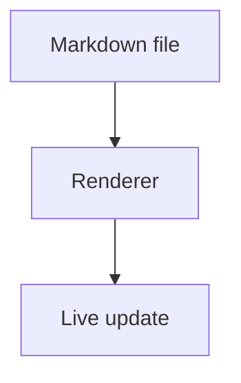

# Build Agent Prompt: Minimal Electron + TypeScript Markdown Viewer

You are a build agent. Implement a minimal desktop markdown viewer using Electron + TypeScript.

## Operating Instructions

- Use `todowrite` at the **start and end of every task** to keep task status current.
- Use **one subagent per numbered step** via the `task` tool (`subagent_type: "general"` is fine unless a different type is clearly better).
- Keep structure flat and minimal.
- Do not add tests at this stage.
- Use TypeScript throughout.
- Follow SOLID principles.

## Goal

Build a minimal markdown viewer that:

- Supports GitHub Flavored Markdown (GFM).
- Supports Mermaid diagrams embedded in markdown code fences.
- Watches the target markdown file and refreshes rendered view on file updates.

## Non-Goals

- No test setup.
- No packaging/distribution setup.
- No extra architecture layers beyond what is needed for SOLID + minimalism.

## Step-by-Step Tasks

### 1) Initialize Project

Run:

```bash
mkdir markdown-viewer
cd markdown-viewer
npm init -y
npm install electron marked mermaid chokidar github-markdown-css
npm install -D typescript @types/node
mkdir src
```

### 2) Create Flat File Structure

Create exactly:

```text
markdown-viewer/
  package.json
  tsconfig.json
  src/
    contracts.ts
    fileService.ts
    markdownService.ts
    viewerController.ts
    main.ts
    preload.ts
    renderer.ts
    index.html
    styles.css
  README.md
```

### 3) Add Project Configuration

`package.json`

```json
{
  "name": "markdown-viewer",
  "version": "1.0.0",
  "private": true,
  "description": "Minimal Electron + TypeScript markdown viewer with Mermaid and file watching",
  "main": "dist/main.js",
  "scripts": {
    "build": "tsc",
    "start": "npm run build && electron dist/main.js"
  },
  "dependencies": {
    "chokidar": "^3.6.0",
    "electron": "^36.0.0",
    "github-markdown-css": "^5.8.1",
    "marked": "^15.0.0",
    "mermaid": "^11.6.0"
  },
  "devDependencies": {
    "@types/node": "^22.15.0",
    "typescript": "^5.8.3"
  }
}
```

`tsconfig.json`

```json
{
  "compilerOptions": {
    "target": "ES2022",
    "module": "CommonJS",
    "moduleResolution": "Node",
    "rootDir": "src",
    "outDir": "dist",
    "strict": true,
    "skipLibCheck": true,
    "esModuleInterop": true,
    "types": ["node"],
    "lib": ["ES2022", "DOM"]
  },
  "include": ["src/**/*.ts"]
}
```

### 4) Implement SOLID Contracts

`src/contracts.ts`

```ts
export interface WatchHandle {
  close(): Promise<void>;
}

export interface FileReader {
  read(filePath: string): Promise<string>;
}

export interface FileWatcher {
  watch(filePath: string, onChange: () => void): Promise<WatchHandle>;
}

export interface MarkdownRenderer {
  render(markdown: string): string;
}
```

### 5) Implement File Infrastructure

`src/fileService.ts`

```ts
import { promises as fs } from "node:fs";
import chokidar from "chokidar";
import type { FileReader, FileWatcher, WatchHandle } from "./contracts";

class ChokidarWatchHandle implements WatchHandle {
  constructor(private readonly closeFn: () => Promise<void>) {}

  async close(): Promise<void> {
    await this.closeFn();
  }
}

export class FileService implements FileReader, FileWatcher {
  async read(filePath: string): Promise<string> {
    try {
      return await fs.readFile(filePath, "utf8");
    } catch {
      return `# File not found\n\n\`${filePath}\``;
    }
  }

  async watch(filePath: string, onChange: () => void): Promise<WatchHandle> {
    const watcher = chokidar.watch(filePath, {
      ignoreInitial: true,
      awaitWriteFinish: {
        stabilityThreshold: 150,
        pollInterval: 50
      }
    });

    watcher.on("add", onChange);
    watcher.on("change", onChange);
    watcher.on("unlink", onChange);

    return new ChokidarWatchHandle(async () => {
      await watcher.close();
    });
  }
}
```

### 6) Implement Markdown Rendering

`src/markdownService.ts`

```ts
import { marked } from "marked";
import type { MarkdownRenderer } from "./contracts";

export class MarkedMarkdownService implements MarkdownRenderer {
  constructor() {
    marked.setOptions({ gfm: true });
  }

  render(markdown: string): string {
    return marked.parse(markdown) as string;
  }
}
```

### 7) Implement Application Orchestrator

`src/viewerController.ts`

```ts
import type {
  FileReader,
  FileWatcher,
  MarkdownRenderer,
  WatchHandle
} from "./contracts";

export class ViewerController {
  private latestHtml = "<p>Loading...</p>";
  private watchHandle: WatchHandle | null = null;
  private filePath = "";

  constructor(
    private readonly fileReader: FileReader,
    private readonly fileWatcher: FileWatcher,
    private readonly markdownRenderer: MarkdownRenderer,
    private readonly publishHtml: (html: string) => void
  ) {}

  getHtml(): string {
    return this.latestHtml;
  }

  async start(filePath: string): Promise<void> {
    this.filePath = filePath;
    await this.refresh();
    this.watchHandle = await this.fileWatcher.watch(this.filePath, () => {
      void this.refresh();
    });
  }

  async stop(): Promise<void> {
    if (this.watchHandle) {
      await this.watchHandle.close();
      this.watchHandle = null;
    }
  }

  private async refresh(): Promise<void> {
    const markdown = await this.fileReader.read(this.filePath);
    this.latestHtml = this.markdownRenderer.render(markdown);
    this.publishHtml(this.latestHtml);
  }
}
```

### 8) Wire Electron Main/Preload

`src/main.ts`

```ts
import path from "node:path";
import { app, BrowserWindow, ipcMain } from "electron";
import { FileService } from "./fileService";
import { MarkedMarkdownService } from "./markdownService";
import { ViewerController } from "./viewerController";

const IPC_GET_HTML = "viewer:get-html";
const IPC_HTML_UPDATED = "viewer:html-updated";

let mainWindow: BrowserWindow | null = null;
let controller: ViewerController | null = null;

function createWindow(): BrowserWindow {
  const window = new BrowserWindow({
    width: 1000,
    height: 760,
    webPreferences: {
      preload: path.join(__dirname, "preload.js"),
      contextIsolation: true,
      nodeIntegration: false
    }
  });

  void window.loadFile(path.join(__dirname, "../src/index.html"));
  return window;
}

app.whenReady().then(async () => {
  mainWindow = createWindow();

  const filePath = path.resolve(process.cwd(), process.argv[2] ?? "README.md");
  const fileService = new FileService();
  const markdownService = new MarkedMarkdownService();

  controller = new ViewerController(
    fileService,
    fileService,
    markdownService,
    (html) => {
      if (mainWindow && !mainWindow.isDestroyed()) {
        mainWindow.webContents.send(IPC_HTML_UPDATED, html);
      }
    }
  );

  ipcMain.handle(IPC_GET_HTML, async () => controller?.getHtml() ?? "<p>Loading...</p>");

  await controller.start(filePath);

  app.on("activate", () => {
    if (BrowserWindow.getAllWindows().length === 0) {
      mainWindow = createWindow();
      const html = controller?.getHtml() ?? "<p>Loading...</p>";
      mainWindow.webContents.send(IPC_HTML_UPDATED, html);
    }
  });
});

app.on("before-quit", async () => {
  if (controller) {
    await controller.stop();
  }
});

app.on("window-all-closed", () => {
  if (process.platform !== "darwin") {
    app.quit();
  }
});
```

`src/preload.ts`

```ts
import { contextBridge, ipcRenderer } from "electron";

const IPC_GET_HTML = "viewer:get-html";
const IPC_HTML_UPDATED = "viewer:html-updated";

contextBridge.exposeInMainWorld("viewerApi", {
  getHtml: (): Promise<string> => ipcRenderer.invoke(IPC_GET_HTML),
  onHtmlUpdated: (handler: (html: string) => void): (() => void) => {
    const listener = (_event: unknown, html: string): void => handler(html);
    ipcRenderer.on(IPC_HTML_UPDATED, listener);
    return () => {
      ipcRenderer.removeListener(IPC_HTML_UPDATED, listener);
    };
  }
});
```

### 9) Implement Renderer + Mermaid Hydration

`src/renderer.ts`

```ts
declare global {
  interface Window {
    viewerApi: {
      getHtml: () => Promise<string>;
      onHtmlUpdated: (handler: (html: string) => void) => () => void;
    };
    mermaid: {
      initialize: (config: Record<string, unknown>) => void;
      run: (options?: Record<string, unknown>) => Promise<void> | void;
    };
  }
}

const root = document.getElementById("app");

if (!root) {
  throw new Error("Missing #app element");
}

window.mermaid.initialize({
  startOnLoad: false,
  securityLevel: "strict",
  theme: "default"
});

function hydrateMermaid(container: HTMLElement): void {
  const codeBlocks = container.querySelectorAll("pre > code.language-mermaid");

  codeBlocks.forEach((code) => {
    const pre = code.parentElement;
    if (!pre) return;

    const div = document.createElement("div");
    div.className = "mermaid";
    div.textContent = code.textContent ?? "";
    pre.replaceWith(div);
  });
}

async function render(html: string): Promise<void> {
  root.innerHTML = html;
  hydrateMermaid(root);
  await Promise.resolve(window.mermaid.run({ querySelector: ".mermaid" }));
}

async function bootstrap(): Promise<void> {
  const initialHtml = await window.viewerApi.getHtml();
  await render(initialHtml);

  window.viewerApi.onHtmlUpdated((nextHtml) => {
    void render(nextHtml);
  });
}

void bootstrap();
```

### 10) Add Static UI Shell

`src/index.html`

```html
<!doctype html>
<html lang="en">
  <head>
    <meta charset="utf-8" />
    <meta name="viewport" content="width=device-width, initial-scale=1" />
    <title>Markdown Viewer</title>
    <link rel="stylesheet" href="../node_modules/github-markdown-css/github-markdown.css" />
    <link rel="stylesheet" href="./styles.css" />
  </head>
  <body>
    <main id="app" class="markdown-body"></main>
    <script src="../node_modules/mermaid/dist/mermaid.min.js"></script>
    <script src="../dist/renderer.js"></script>
  </body>
</html>
```

`src/styles.css`

```css
:root {
  --bg: #f6f8fa;
  --panel: #ffffff;
}

* {
  box-sizing: border-box;
}

body {
  margin: 0;
  background: var(--bg);
}

#app {
  width: min(960px, 100%);
  min-height: 100vh;
  margin: 0 auto;
  padding: 32px 20px;
  background: var(--panel);
}

@media (max-width: 768px) {
  #app {
    padding: 20px 14px;
  }
}
```

### 11) Add Sample Markdown for Manual Verification

`README.md`

````md
# Markdown Viewer

- [x] GFM task list
- **Bold**
- ~~Strikethrough~~


````

### 12) Build and Run

Run:

```bash
npm start
```

To open a specific markdown file:

```bash
npm start -- ./docs/notes.md
```

## SOLID Compliance Requirements

- **S (Single Responsibility):**
  - `FileService`: file IO + watch only.
  - `MarkedMarkdownService`: markdown-to-HTML only.
  - `ViewerController`: orchestration only.
  - `main.ts`: Electron lifecycle + composition root.
  - `renderer.ts`: DOM update + Mermaid hydration only.
- **O (Open/Closed):** new markdown engines via new `MarkdownRenderer` implementation.
- **L (Liskov):** any implementation of each contract can replace the default.
- **I (Interface Segregation):** focused interfaces (`FileReader`, `FileWatcher`, `MarkdownRenderer`).
- **D (Dependency Inversion):** `ViewerController` depends on abstractions from `contracts.ts`.

## Acceptance Criteria

- App launches with `npm start`.
- If no CLI arg is provided, app loads `README.md`.
- GFM renders correctly (task lists, emphasis, etc.).
- Mermaid blocks render as diagrams.
- Editing the markdown file updates the view automatically without app restart.
- Architecture remains flat, minimal, and SOLID-compliant.
