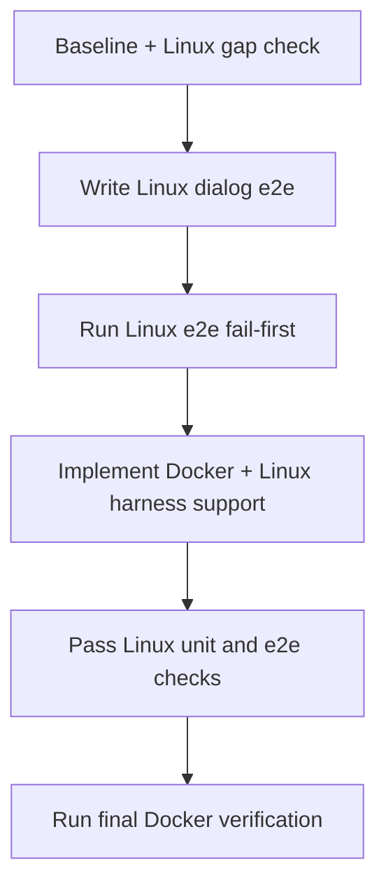

# Linux Docker Open File Dialog Support

## Current Baseline

- `src/openFileDialog.ts` already calls `dialog.showOpenDialog({ properties: ['openFile'], filters: [...] })`.
- `e2e/features/open-file.feature` is tagged `@macos` and uses AppleScript-backed steps, so it does not verify dialog behavior on Linux.
- `wdio.conf.ts` already starts `Xvfb` on Linux and packages a Linux app binary before e2e runs.
- `package.json` maps `npm run test:e2e` to `wdio run wdio.conf.ts`.
- `wdio.conf.ts` currently runs non-`@macos` scenarios on Linux via `cucumberOpts.tagExpression: "not @macos"` and packages the app in `onPrepare` before the scenario starts.
- `Dockerfile` currently uses `debian:trixie-slim`; package selection must stay compatible with that distro.
- `Dockerfile` installs `xvfb` and core Electron runtime libraries, but it does not install Linux GUI automation tools for finding and dismissing the native file chooser.

## Prompt

You are an orchestration agent.

Your exact goal is to make the Linux Docker container support exercising the existing `File -> Open` native dialog flow from the open-file plans, and to verify that flow with Linux-safe e2e coverage.

Non-goals:

- Do not implement file loading or renderer updates from the selected file.
- Do not replace the native dialog with a custom renderer dialog.
- Do not weaken or remove the existing macOS `@macos` dialog coverage.
- Do not redesign unrelated Docker or CI workflows.
- Do not add Windows-specific automation in this plan.

## Critical Operating Rules

- Work only through the exact todo list in this document.
- Work on exactly one todo at a time.
- Update `todowrite` before delegating a step and immediately after verifying completion.
- Delegate every execution step to a subagent with the single-step contract below.
- Use fail-first sequencing for any new Linux dialog test coverage.
- Separate product failures from container, packaging, display-server, and GUI automation failures.
- Do not mark a step complete without evidence: changed files, exact commands run, and observed result.
- Keep Linux dialog assertions user-visible; do not assert internal Electron implementation details in e2e.



## Exact Todo List

1. `Milestone 1 / Step 1: Capture Linux Docker baseline and dialog automation gaps`
2. `Milestone 2 / Step 1: Write Linux open dialog e2e coverage`
3. `Milestone 2 / Step 2: Run Linux open dialog e2e in Docker and confirm expected failure`
4. `Milestone 3 / Step 1: Implement Linux Docker dialog support and cleanup`
5. `Milestone 3 / Step 2: Pass focused Linux unit tests in Docker`
6. `Milestone 3 / Step 3: Pass focused Linux open dialog e2e in Docker`
7. `Final Verification / Step 1: Run final Linux Docker verification suite`

Initial todo state:

- mark `Milestone 1 / Step 1: Capture Linux Docker baseline and dialog automation gaps` as `in_progress`
- mark every other todo as `pending`

## Required Execution Pattern

For every step, follow this exact loop:

1. Mark only the current todo `in_progress` in `todowrite`.
2. Delegate only that step to a subagent.
3. Wait for the subagent to stop.
4. Review the returned evidence.
5. Mark the step `completed` only if the evidence matches this plan.
6. Move the next step to `in_progress`.
7. Do not begin the next step until the current one is verified complete.

## Required Subagent Prompt Contract

Every delegated step must include these directives verbatim:

- `You are authorized for this single step only.`
- `Do not start the next step.`
- `When you finish, stop and report back with: step completed, files changed, commands run, and observed result.`
- `Do not guess at failures; use evidence from logs, test output, and code inspection.`

For every failed command, require the subagent to also report:

- exact exit code
- one failure classification label: `product`, `container`, `display`, or `packaging`

Evidence bundle order for every step:

1. step id
2. files changed
3. commands run
4. exit codes
5. failure classification, if any
6. key log lines or observed result

## Expected File Targets

Plan for changes in these locations unless the fail-first evidence proves a different file is required:

- `Dockerfile`
- `e2e/features/open-file-linux.feature`
- `e2e/steps/open-file-linux.steps.ts`
- `e2e/support/hooks.ts`
- `e2e/support/linuxOpenFileDialog.ts`
- optionally `package.json` only if one focused Docker-friendly script materially reduces guesswork
- optionally `wdio.conf.ts` only if Linux tagging or display startup needs a minimal targeted adjustment

Do not modify the existing macOS scenario in `e2e/features/open-file.feature` unless shared wording or hooks must be aligned for stability.

## Todo Interface Instructions

Use `todowrite` with one exact todo item `in_progress` at a time and every other item set to `pending` or `completed`.

Before Step 1 starts, confirm the executor runtime has `todowrite` available. If it does not, stop and report the missing orchestration capability before making repo changes.

Required proof of `todowrite` availability:

- include either the orchestrator capability acknowledgment or the first successful `todowrite({...})` response in the evidence bundle before any repo-editing step begins

Expected `todowrite` invocation shape:

```text
todowrite({
  todos: [
    { content: "Milestone 1 / Step 1: Capture Linux Docker baseline and dialog automation gaps", status: "in_progress", priority: "high" },
    { content: "Milestone 2 / Step 1: Write Linux open dialog e2e coverage", status: "pending", priority: "high" }
  ]
})
```

Use the exact todo text from `## Exact Todo List` and the statuses `pending`, `in_progress`, or `completed` only.

Initial `todowrite` payload must represent these exact items and states:

- `Milestone 1 / Step 1: Capture Linux Docker baseline and dialog automation gaps` - `in_progress`
- every remaining todo from `## Exact Todo List` - `pending`

If a step fails, do not start another step. Leave the failing step `in_progress` until the failure is classified and the evidence is returned.

Example status transition payload shape:

```text
Milestone 1 / Step 1: in_progress
Milestone 2 / Step 1: pending
...
Final Verification / Step 1: pending
```

Exit-code capture rule:

- run milestone-gating commands one at a time
- record the exit code immediately after each command before running the next one
- if a wrapper command is used, it must still emit the underlying command and its exit code in the evidence bundle
- report raw transcript snippets inline in the subagent handoff unless the executor explicitly names an artifact file path in the same response

## Step Reuse Guidance

Before writing new Linux steps, inspect and explicitly reuse or extract from these existing locations:

- `e2e/steps/open-file.steps.ts` for `When the user clicks File Open`
- `src/applicationMenu.ts` for stable menu item id `file-open`
- `e2e/support/hooks.ts` for existing `After` hook ownership

If shared menu-trigger logic is extracted, move only that shared logic into a helper and leave macOS-only AppleScript behavior isolated from Linux X11 behavior.

Current file-existence baseline for delegation safety:

- `e2e/features/open-file-linux.feature` does not exist yet and should be created
- `e2e/support/linuxOpenFileDialog.ts` does not exist yet and should be created
- if a later baseline check finds either file already exists, update in place instead of overwriting blindly

## Milestone 1: Baseline And Gap Capture

### Step 1: Capture Linux Docker baseline and dialog automation gaps

Confirm the current Linux container can build and run the packaged app, then prove which missing dependency blocks Linux dialog automation.

Commands:

```bash
docker version
grep -n '^FROM ' Dockerfile
sed -n '/After/,+8p' e2e/support/hooks.ts
python - <<'PY'
from pathlib import Path
text = Path('e2e/support/hooks.ts').read_text()
start = text.find('After(')
if start == -1:
    raise SystemExit('After hook not found')
end = text.find('\n});', start)
if end == -1:
    raise SystemExit('After hook end not found')
print(text[start:end+4])
PY
docker build -t markdown-viewer-open-dialog -f Dockerfile .
docker run --rm -v "$PWD:/app" -w /app markdown-viewer-open-dialog npm ci
docker run --rm -v "$PWD:/app" -w /app markdown-viewer-open-dialog npm run build
docker run --rm -v "$PWD:/app" -w /app markdown-viewer-open-dialog npm test -- --run src/openFileDialog.test.ts src/applicationMenu.test.ts
docker run --rm -v "$PWD:/app" -w /app markdown-viewer-open-dialog sh -lc 'which Xvfb && which xdotool && which xprop && which xdpyinfo'
docker run --rm -v "$PWD:/app" -w /app markdown-viewer-open-dialog sh -lc 'apt-cache policy xdotool x11-utils dbus-x11 openbox'
docker run --rm -v "$PWD:/app" -w /app markdown-viewer-open-dialog sh -lc 'grep -n "test:e2e" package.json && grep -n "specs:\|require:\|tagExpression\|onPrepare\|beforeSession\|appBinaryPath" wdio.conf.ts'
```

Completion conditions:

- Docker image builds successfully from the current `Dockerfile`.
- Focused unit tests pass in the container before Linux e2e work starts.
- Evidence shows which Linux GUI automation tools are missing or unusable.
- Any failure is classified with the enforced labels only: `product`, `container`, `display`, or `packaging`.
- evidence bundle includes per-command exit code lines in the required order

If `docker version` fails or the daemon is unreachable before repo commands run:

- classify the failure as `container`
- stop immediately
- report the raw Docker error text without making code changes

Expected failure signatures at this stage:

- `which xdotool` not found
- `which xprop` not found
- `xdpyinfo` missing or cannot connect to display

Required evidence artifacts:

- raw transcript snippets for each gating command in the same order they were run
- each raw transcript snippet must include the command line, one key output line, and the exit code line
- `docker build` result
- exit codes for `docker build`, `npm ci`, `npm run build`, and focused unit tests
- `which` output for `Xvfb`, `xdotool`, `xprop`, and `xdpyinfo`
- `apt-cache policy xdotool x11-utils dbus-x11 openbox` output and exit code
- the `grep` output proving the `npm run test:e2e` execution path, Linux tag behavior, and WDIO step-definition discovery pattern
- the exact `wdio.conf.ts` line numbers and contents for whichever keys define feature/spec discovery and step-definition loading, including `specs` and `cucumberOpts.require` if present
- if `specs` or `require` are absent from the grep output, preserve the raw grep snippet showing that absence rather than summarizing it
- the baseline distro evidence showing `debian:trixie-slim` from `grep -n '^FROM ' Dockerfile`
- if possible, one recorded line identifying the Linux chooser title or a note that title-agnostic detection is required because no stable title is exposed yet
- the exact current contents or behavior summary of the `After` hook in `e2e/support/hooks.ts`, including current cleanup function names if present, backed by `sed -n '/After/,+8p' e2e/support/hooks.ts`
- full `After` hook body captured, or explicit confirmation that the full hook fits within the captured 8-line window

## Milestone 2: Linux E2E Fail-First

### Step 1: Write Linux open dialog e2e coverage

Add a Linux-specific feature and step definitions that exercise the same user outcome as the macOS plan: clicking `File -> Open` surfaces the native dialog, dismissing it leaves no dialog behind.

Use this exact Gherkin in `e2e/features/open-file-linux.feature`:

```gherkin
@linux
Feature: Open file dialog on Linux

  Scenario: File Open shows the native open dialog in the Docker container
    When the user clicks File Open
    And the user dismisses the Open File dialog on Linux
    Then the Open File dialog is not present on Linux
```

Step-definition requirements:

- Reuse the existing menu-trigger behavior for `When the user clicks File Open` or move that shared logic into a helper if duplication would be worse.
- Implement Linux-only dialog discovery and dismissal through X11-safe command-line tools, not AppleScript.
- Prefer `xdotool` for window search/focus/key input and `xprop` or `xdotool search` for dialog-presence checks.
- Match against the actual Linux chooser title observed in the container baseline; if multiple titles are possible, centralize the accepted patterns in one helper.
- Keep cleanup ownership in one canonical location only.

Files expected:

- `e2e/features/open-file-linux.feature`
- `e2e/steps/open-file-linux.steps.ts`
- `e2e/support/linuxOpenFileDialog.ts`
- `e2e/support/hooks.ts`

### Step 2: Run Linux open dialog e2e in Docker and confirm expected failure

Run the new Linux scenario in the container after writing the Linux-specific test/helper code from Step 1, but before any Docker/package/harness remediation from Milestone 3.

Command:

```bash
docker run --rm -v "$PWD:/app" -w /app markdown-viewer-open-dialog npm run test:e2e -- --spec ./e2e/features/open-file-linux.feature
```

Expected failure reasons:

- the container lacks `xdotool`, `xprop`, or another required Linux GUI automation package
- the helper cannot discover the native dialog window under Xvfb because the container image is missing the required X11 tooling

Expected-failure evidence must include one of these signatures or an equally specific missing-tooling message:

- `xdotool: not found`
- `xprop: not found`
- `xdpyinfo: not found`
- `Can't open display`
- helper-thrown error that explicitly names a missing Linux dialog automation dependency

If the Linux e2e unexpectedly passes before any Docker or harness change:

- classify the result as `already supported`
- treat `already supported` as an outcome status only, not as a failure classification label
- do not modify `Dockerfile` or Linux dialog helpers
- rerun the same Linux e2e command a second time and require a second pass before claiming repeatability
- skip directly to `Final Verification / Step 1`
- for macOS non-regression in this Linux-only workflow, default to diff-based proof: no changes to `e2e/features/open-file.feature` unless explicitly justified, and no hook regressions in `e2e/support/hooks.ts`
- mark `Milestone 3 / Step 1: Implement Linux Docker dialog support and cleanup`, `Milestone 3 / Step 2: Pass focused Linux unit tests in Docker`, and `Milestone 3 / Step 3: Pass focused Linux open dialog e2e in Docker` as `completed` only with evidence text `skipped: already supported by baseline Linux Docker flow`; do not leave them `pending`
- provide the standard evidence bundle format for both Linux e2e reruns, including the exact command, exit code, and key log lines from each passing run
- carry forward the same non-regression checks from `## Verification` in the skip report, specifically `e2e/features/open-file.feature` unchanged unless justified and `e2e/support/hooks.ts` macOS cleanup preserved
- include `git diff -- e2e/features/open-file.feature e2e/support/hooks.ts` output in the skip report to make the non-regression proof reproducible

Non-acceptable failure reasons:

- TypeScript syntax errors in unrelated files
- the existing `File -> Open` menu item disappeared
- the app no longer packages on Linux
- `npm run package` failed before test startup without a Linux dialog-tooling error; classify that as `packaging`, stop, and report it separately

## Milestone 3: Implement Linux Docker Support

### Step 1: Implement Linux Docker dialog support and cleanup

Update the Docker and Linux e2e harness so the container can find, dismiss, and verify the native file chooser reliably.

Required implementation constraints:

- Add only the smallest Linux packages needed for dialog automation and inspection.
- Prefer `xdotool`, `x11-utils`, and any one additional package only if the fail-first evidence proves it is required.
- Keep package installation in the existing `apt-get install` layer in `Dockerfile`.
- If a window manager is required for reliable focus behavior under `Xvfb`, add exactly one lightweight manager and document why in the code or plan evidence.
- Put Linux dialog shell interactions behind `e2e/support/linuxOpenFileDialog.ts`; do not inline shell scripts across multiple step files.
- Put canonical dialog cleanup in `e2e/support/hooks.ts`; do not duplicate cleanup logic in step definitions.
- Do not change the product behavior of `src/openFileDialog.ts` during this milestone unless the evidence proves Linux runtime support is incomplete.
- If `apt-get` cannot install a proposed package on Debian trixie, stop and report the exact package name and apt error text; do not substitute a different package unless the fail-first evidence and Debian package metadata make the replacement obvious.
- If the most recent package addition breaks `docker build`, revert only that last package change before retrying, and include the failed build evidence plus the reverted package name in the report.
- If `npm ci`, `apt-cache`, or package installation fails because of transient network, mirror, or package-index issues, classify that as `container`, stop, and report it as infrastructure rather than product behavior.

Potential file outputs:

- `Dockerfile`
- `e2e/support/linuxOpenFileDialog.ts`
- `e2e/steps/open-file-linux.steps.ts`
- `e2e/support/hooks.ts`
- optionally `wdio.conf.ts` if Linux startup needs a minimal display or timing adjustment

Before running Step 2 or Step 3 in this milestone, rebuild the Docker image if `Dockerfile` or installed-package assumptions changed.

Required rebuild command:

```bash
docker build -t markdown-viewer-open-dialog -f Dockerfile .
```

Required rebuild evidence:

- exact rebuild command
- exit code
- confirmation that the image used for Step 2 and Step 3 was built after the latest `Dockerfile` edits

### Step 2: Pass focused Linux unit tests in Docker

Command:

```bash
docker run --rm -v "$PWD:/app" -w /app markdown-viewer-open-dialog npm test -- --run src/openFileDialog.test.ts src/applicationMenu.test.ts
```

Completion conditions:

- unit tests pass in the updated container
- no regressions to menu wiring or open-dialog helper behavior
- record the exact exit code

### Step 3: Pass focused Linux open dialog e2e in Docker

Command:

```bash
docker run --rm -v "$PWD:/app" -w /app markdown-viewer-open-dialog npm run test:e2e -- --spec ./e2e/features/open-file-linux.feature
```

Completion conditions:

- the Linux scenario passes in the Docker container
- evidence shows the dialog was found, dismissed, and confirmed absent afterward
- no macOS-only tooling is referenced during Linux execution
- record the exact exit code

Required pass evidence:

- helper output using a stable prefix such as `LINUX_OPEN_DIALOG:` for every diagnostic line
- one `LINUX_OPEN_DIALOG:` line naming the window selector, title pattern, or title-agnostic detection path used
- one `LINUX_OPEN_DIALOG:` line confirming the dismissal action performed (`Escape`, `Cancel`, or equivalent)
- one `LINUX_OPEN_DIALOG:` line or command result confirming the dialog is absent after dismissal

## Failure Classification

Classify failures before changing code:

Label mapping for subagent reports:

- runtime library failure -> `container`
- missing automation tooling -> `container`
- display server failure -> `display`
- packaging failure -> `packaging`
- product behavior failure -> `product`

- Product failure
  - `File -> Open` callback does not launch `dialog.showOpenDialog`
  - dialog remains visible after dismissal attempt because the Linux automation helper targeted the wrong window
- Container/runtime failure
  - missing package binaries such as `xdotool`, `xprop`, `xdpyinfo`, or a required window manager
  - Electron fails to start because a shared library required by the Linux file chooser is missing
- Display-server failure
  - `Can't open display`
  - `X connection to :99 broken`
  - dialog window cannot be enumerated because `Xvfb` or display export is not active
- Packaging failure
  - `npm run package` fails before the app starts
  - Linux unpacked binary is missing from `release/linux-unpacked/markdown-viewer` or `release/linux-arm64-unpacked/markdown-viewer`

Any `packaging` failure during fail-first or post-implementation runs blocks further code edits until the packaging issue is resolved or explicitly reclassified with evidence.

## Linux Dialog Helper Guidance

Implement one helper module with explicit functions for:

- waiting for the Linux open dialog to appear
- dismissing the dialog, preferably by sending `Escape` or activating a `Cancel` control through `xdotool`
- checking whether the dialog is still present
- best-effort cleanup from `After` hooks

Helper requirements:

- keep all title matching and retry intervals in one place
- poll for at most 10 seconds unless fail-first evidence proves a different timeout is necessary
- report actionable errors that include the command attempted and the missing dependency or failed selector
- avoid fragile sleeps when a retry loop can observe state directly

## Docker Package Guidance

Default package candidates to evaluate from fail-first evidence:

- `xdotool`
- `x11-utils`
- `dbus-x11` only if the chooser or Electron runtime requires a session bus in the container
- one lightweight window manager such as `openbox` only if focus or dialog discovery is unreliable without it

Do not add broad desktop environments, VNC stacks, or unrelated browser tooling.

## Verification

Run these commands after implementation completes:

```bash
docker build -t markdown-viewer-open-dialog -f Dockerfile .
docker run --rm -v "$PWD:/app" -w /app markdown-viewer-open-dialog npm ci
docker run --rm -v "$PWD:/app" -w /app markdown-viewer-open-dialog npm run build
docker run --rm -v "$PWD:/app" -w /app markdown-viewer-open-dialog npm test -- --run src/openFileDialog.test.ts src/applicationMenu.test.ts
docker run --rm -v "$PWD:/app" -w /app markdown-viewer-open-dialog npm run test:e2e -- --spec ./e2e/features/open-file-linux.feature
```

If the repository already has a container-specific CI entrypoint or make target for these commands, the executor may use it only after proving it is equivalent to the commands above.

Also verify these non-Linux-regression checks:

- `e2e/features/open-file.feature` remains unchanged unless a shared helper extraction or hook alignment was required
- any change to `e2e/support/hooks.ts` still preserves the existing macOS cleanup behavior
- each verification command reports its exit code in the evidence bundle
- run `git diff -- e2e/features/open-file.feature e2e/support/hooks.ts` and include the output in the evidence bundle

Final handoff artifact requirement:

- final report must include the exact verification commands, their exit codes, and the `LINUX_OPEN_DIALOG:` diagnostic lines proving dialog detection, dismissal, and absence confirmation
- if `LINUX_OPEN_DIALOG:` lines are not visible in normal test stdout, include the exact log capture path or command used to surface them in the final report
- default fallback capture command for missing `LINUX_OPEN_DIALOG:` stdout lines:

```bash
docker run --rm -v "$PWD:/app" -w /app markdown-viewer-open-dialog npm run test:e2e -- --spec ./e2e/features/open-file-linux.feature | tee /tmp/open-file-linux-e2e.log
grep 'LINUX_OPEN_DIALOG:' /tmp/open-file-linux-e2e.log
```

## Acceptance Criteria

- `Dockerfile` installs the minimal Linux packages required to automate the native open dialog in the container.
- a Linux-specific e2e scenario verifies `File -> Open` opens a native dialog and that dismissing it leaves no dialog present.
- Linux dialog automation lives in one helper module, not scattered across step files.
- cleanup for a lingering Linux open dialog is defined in one canonical place.
- focused unit tests for `src/openFileDialog.ts` and `src/applicationMenu.ts` pass in the container.
- focused Linux open-dialog e2e passes in the container.
- existing macOS dialog coverage remains intact and is not replaced.
