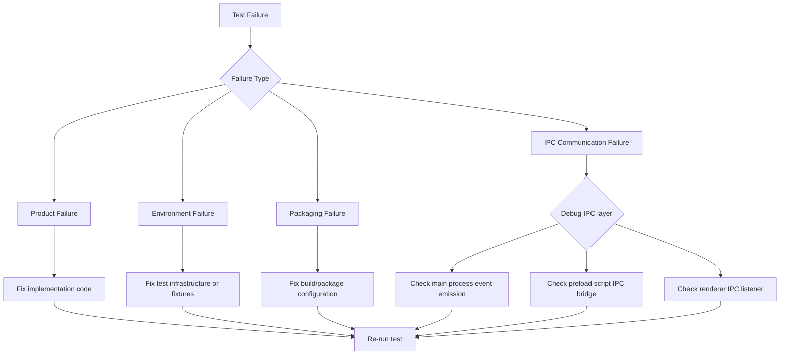

# macOS Fullscreen Toolbar Handling

## Prompt

Implement macOS-native toolbar positioning when the app enters fullscreen mode. Currently, the toolbar button stays in the same position when entering fullscreen, but because the stoplight buttons (window controls) disappear in fullscreen mode, the button doesn't look right. The button should move to the left edge of the window (remove the left padding) when in fullscreen mode, similar to Safari's behavior.

## Non-negotiable Rules

- **Platform-specific**: This feature only applies to macOS (`process.platform === 'darwin'`)
- **Test-first approach**: Write tests to verify the behavior before implementation
- **No visual regression**: Windowed mode behavior must remain unchanged
- **Follow existing patterns**: Use the same CSS variable and class-based approach already established in the codebase
- **Type safety**: All TypeScript code must pass type checking with strict mode
- **Zero lint warnings**: ESLint must pass with zero warnings
- **Class target**: The `is-fullscreen` class will be applied to `document.documentElement` (the `<html>` element)
- **E2E platform handling**: E2E tests will skip entirely on non-macOS platforms using runtime `process.platform` checks in step definitions

## Context To Gather Before Execution

**These tasks are the first actions within Step 1.1** before writing tests:

1. **Electron Event Names**: Confirm Electron 41 uses `enter-full-screen` and `leave-full-screen` event names (with hyphens) on BrowserWindow
2. **DOM Testing Setup**: Check `src/renderer.test.ts` to confirm the DOM testing library used (happy-dom or JSDOM)
3. **E2E Platform Skip Pattern**: Review `e2e/steps/toc-sidebar.steps.ts` to see how platform-specific tests are skipped
4. **Platform Class Target**: Verify in `src/index.html` that `platform-macos` class is added to `<html>` element (line 10)
5. **IPC Naming Convention**: Check existing IPC constants in `src/main.ts` and `src/preload.ts` to confirm naming pattern (e.g., `IPC_GET_HTML`, `IPC_HTML_UPDATED`)
6. **Electron Mocking Pattern**: Review `src/viewerController.test.ts` to see how Electron APIs are mocked in unit tests

## Current State

### Baseline Behavior

1. **Windowed Mode (macOS)**:
   - The `.toolbar` has `padding-left: var(--macos-traffic-light-offset)` (72px)
   - This padding accounts for the stoplight buttons (close, minimize, maximize)
   - The toolbar button appears offset from the left edge

2. **Fullscreen Mode (macOS)**:
   - The stoplight buttons disappear (they only appear on hover in fullscreen)
   - The toolbar button maintains the same 72px offset
   - This creates awkward empty space on the left side of the toolbar

3. **Expected Behavior (like Safari)**:
   - In fullscreen mode, the toolbar button should move to the left edge
   - The `padding-left` should be removed or set to 0 when in fullscreen

### Key Files

- `src/index.html` - Contains the toolbar structure and platform detection script
- `src/styles.css` - Contains the CSS for toolbar positioning (lines 64-66)
- `src/main.ts` - Electron main process where fullscreen events are handled
- `src/preload.ts` - IPC bridge for renderer communication
- `src/contracts.ts` - TypeScript interfaces for IPC

## Exact Todo List

1. **E2E Test-First**: Write Gherkin scenarios and step definitions, verify they fail as expected
2. **CSS Implementation**: Add fullscreen-aware CSS rules with unit tests
3. **IPC Contract**: Define IPC interface for fullscreen state communication
4. **Main Process**: Implement fullscreen event listeners and IPC messaging with unit tests
5. **Preload Script**: Expose fullscreen state API to renderer with unit tests
6. **Renderer Integration**: Consume fullscreen state and apply CSS class with unit tests
7. **Run E2E Tests**: Execute E2E tests and verify they pass
8. **Final Verification**: Run all tests, typecheck, and lint

## Execution Pattern

**Work on exactly one step at a time**. For each step:
1. Update `todowrite` to mark the current step as `in_progress`
2. Delegate the step to a subagent with a specific prompt
3. Wait for the subagent to complete and report evidence
4. Verify the evidence matches the success condition
5. Mark the step as `completed` in `todowrite`
6. Move to the next step

**Do not start the next step until the current step is complete.**

## Subagent Prompt Contract

When delegating a step to a subagent, use this template:

```
You are authorized to work on ONLY this step: [STEP_NAME]

**Do not start the next step.** Stop after completing this step and report:
- Files changed (with line numbers if applicable)
- Commands run (with full output or error messages)
- Observed result (evidence of success or failure)

If you encounter any errors, blockers, or ambiguity, stop immediately and report them.
```

## Milestone 1: E2E Test-First (Fail-First)

### Goal
Write end-to-end tests that verify the toolbar positioning behavior in fullscreen mode, then verify they fail as expected before implementation begins.

### Files to Change
- `e2e/features/fullscreen-toolbar.feature` (new) - Gherkin scenario
- `e2e/steps/fullscreen-toolbar.steps.ts` (new) - Step definitions

### Critical Operating Rule
**DO NOT IMPLEMENT ANY FUNCTIONALITY YET.** Write the tests first, run them, and confirm they fail with the expected error messages. This validates that the tests are actually testing the behavior before we implement the fix.

### Steps

#### Step 1.1: Write Gherkin Scenario
**Output**: `e2e/features/fullscreen-toolbar.feature`

**Exact Wording**:
```gherkin
Feature: Fullscreen toolbar positioning on macOS

  Scenario: Toolbar button moves to left edge in fullscreen mode
    Given the app is running on macOS
    When I enter fullscreen mode
    Then the toolbar button should move to the left edge of the window
    And there should be no visible gap between the button and the window edge

  Scenario: Toolbar button returns to normal position when exiting fullscreen
    Given the app is in fullscreen mode on macOS
    When I exit fullscreen mode
    Then the toolbar button should return to its original position
    And there should be a gap accounting for the stoplight buttons
```

**Note**: The `@macos-only` tag has been intentionally omitted. Platform-specific skipping is handled via runtime `process.platform` checks in the step definitions (see Step 1.2), consistent with the project's existing E2E patterns.

**Completion Condition**: Feature file exists with clear, testable scenarios

#### Step 1.2: Implement Step Definitions
**Output**: `e2e/steps/fullscreen-toolbar.steps.ts`

**Implementation**:
- Use WebDriver to toggle fullscreen mode via Electron's `setFullScreen()` API or browser window commands
- Query the computed CSS `padding-left` value of the `.toolbar` element
- Assert the expected values for fullscreen vs windowed mode

**Key Considerations**:
- Fullscreen automation may require special WebDriver capabilities
- CSS value assertions should use approximate matching (e.g., "less than 10px" for fullscreen, "approximately 72px" for windowed)
- Platform check should skip tests on non-macOS platforms using runtime `process.platform` check in step definitions

**Example Fullscreen Toggle Pattern**:
```typescript
// Using Electron's API via WDIO
await browser.electron.execute((app, window) => {
  window.setFullScreen(true); // or false
});
```

**Platform Skip Pattern**:
```typescript
if (process.platform !== 'darwin') {
  return this.skip('Fullscreen toolbar positioning is macOS-only');
}
```

**Note**: Verify the correct skip API by checking `e2e/steps/toc-sidebar.steps.ts` or `e2e/support/hooks.ts`. The skip mechanism may be `this.skip()`, `pending()`, or a custom helper.

**Completion Condition**: Step definitions compile and execute

#### Step 1.3: Run E2E Tests and Verify Expected Failures
**Output**: E2E test execution results showing expected failures.

**Commands**:
```bash
npm run package
npm run test:e2e
```

**Expected Failure Mode**:
- Tests should **fail** because the fullscreen CSS rules and IPC communication are not yet implemented
- The failure should be in the assertion step (e.g., "expected padding-left to be less than 10px, but got 72px")
- This confirms the tests are correctly detecting the current (broken) behavior

**Expected vs. Unexpected Failures**:

**Expected Failure Mode** (proceed after documenting):
- Tests reach the CSS assertion step
- Assertion fails: "expected padding-left to be less than 10px, but got 72px"
- This confirms the test correctly detects the missing implementation

**Unexpected Failure Mode** (fix before proceeding):
- Fullscreen toggle throws an error
- Element `.toolbar` not found
- Test crashes before reaching assertion
- Platform skip logic fails

**If unexpected failures occur**: Fix the test infrastructure first (e.g., fullscreen toggle helpers, element selectors, platform skip logic) before proceeding. Document any infrastructure fixes made.

**Critical Operating Rule for Milestone 1**:
You may fix test infrastructure (element selectors, fullscreen toggle helpers, platform skip logic) but do NOT implement:
- CSS rules for fullscreen toolbar positioning
- IPC communication for fullscreen state
- Class toggling on `document.documentElement`

**Evidence Required**:
- Save full test output to `e2e/logs/milestone1-failures.txt`
- Highlight the specific assertion failure message
- Note any infrastructure issues that were fixed to reach the assertion

**Success Criteria**:
- E2E tests run without syntax errors
- Both scenarios reach the CSS assertion step and fail there
- Tests fail with clear assertion errors showing the toolbar has the wrong padding in fullscreen
- Failure output is documented for comparison with Milestone 4

**Note**: Packaging is required because E2E tests run against the packaged binary, not development mode. This is a prerequisite for all E2E tests regardless of implementation status.

**Completion Condition**: E2E tests fail as expected at the CSS assertion step, confirming they will validate the correct behavior once implemented

## Milestone 2: CSS Implementation (Test-First)

### Goal
Add CSS rules that remove the left padding on the toolbar when the window is in fullscreen mode on macOS.

### Files to Change
- `src/styles.css` - Add fullscreen-specific CSS rules

### Critical Operating Rule
**Write the unit test first**, run it to confirm it fails, then implement the CSS rules.

### Steps

#### Step 2.1: Write CSS Unit Test
**Output**: A unit test file `src/styles.test.ts` using Vitest.

The test will verify:
- The CSS file contains the expected fullscreen rules (`.platform-macos.is-fullscreen .toolbar { padding-left: 0; }`)
- The rules are properly scoped to macOS platform
- Read the actual `src/styles.css` file and assert the presence of the fullscreen rule

**Implementation Pattern**:
```typescript
import { readFileSync } from 'node:fs';
import { join } from 'node:path';

describe('styles.css', () => {
  it('contains fullscreen toolbar rules for macOS', () => {
    const cssContent = readFileSync(join(__dirname, 'styles.css'), 'utf-8');
    expect(cssContent).toContain('.platform-macos.is-fullscreen .toolbar');
    expect(cssContent).toContain('padding-left: 0');
  });
});
```

**Completion Condition**: Test file exists and **fails** (because implementation doesn't exist yet)

#### Step 2.2: Implement CSS Rules
**Output**: Updated `src/styles.css` with fullscreen-aware toolbar positioning.

**Implementation**:
Add a CSS rule that targets the fullscreen state. There are two approaches:

**Approach A: CSS-only with `:fullscreen` pseudo-class** (preferred if it works)
```css
.platform-macos:fullscreen .toolbar {
  padding-left: 0;
}
```

**Approach B: Class-based (fallback)**
```css
.platform-macos.is-fullscreen .toolbar {
  padding-left: 0;
}
```

**Expected Behavior**:
- When the app is in fullscreen on macOS, the toolbar padding-left becomes 0
- When not in fullscreen, the original 72px padding is maintained

**Completion Condition**: CSS rules are added and the test from Step 2.1 **passes**

## Milestone 3: Fullscreen State Communication (IPC) with Test-First

### Goal
Establish IPC communication from the Electron main process to the renderer to signal fullscreen state changes, with unit tests written first for each component.

### Files to Change
- `src/contracts.ts` - Add fullscreen state interface
- `src/main.ts` - Add fullscreen event listeners
- `src/preload.ts` - Expose fullscreen API
- `src/rendererBootstrap.ts` - Subscribe to fullscreen state changes

### Dependencies
- **Step 3.4 (Renderer Integration) cannot start until Step 3.3 (Preload Script) exposes the `fullscreen` API**. The `viewerApi.fullscreen` property will be undefined until the preload script is updated.

### Critical Operating Rule
**Write unit tests BEFORE implementation for each step.** Run the test to confirm it fails, then implement the functionality to make it pass.

### Steps

#### Step 3.1: Define IPC Contract (Test-First)
**Output**: Updated `src/contracts.ts` with fullscreen state types.

**Test-First Approach for Types**:
1. Write a simple TypeScript file (e.g., `src/contracts.test.ts`) that imports and attempts to use `FullscreenApi` from `contracts.ts`
2. Run `npm run typecheck` - it should fail with errors about missing `FullscreenApi` interface
3. Implement the interface in `contracts.ts`
4. Re-run `npm run typecheck` - it should pass

**Example Type Check Test** (write this first):
```typescript
// This file tests that the types compile correctly
import type { FullscreenApi, ViewerApi } from './contracts';

// This will fail to compile until FullscreenApi is defined
const _testFullscreenApi: FullscreenApi = {
  getInitialState: async () => false,
  onStateChanged: () => {}
};

// Verify ViewerApi includes fullscreen property
const _testViewerApi: ViewerApi = {
  fullscreen: _testFullscreenApi
  // ... other properties will cause errors until all are implemented
};
```

**Implementation**:
Extend the existing `ViewerApi` interface to include a `fullscreen` property. The `FullscreenApi` interface should be exported from `contracts.ts` for type safety across main and renderer processes.

```typescript
export interface FullscreenApi {
  getInitialState(): Promise<boolean>;
  onStateChanged(callback: (isFullscreen: boolean) => void): void;
}

export interface ViewerApi {
  // ... existing properties
  fullscreen: FullscreenApi;
}
```

Also define IPC channel constants that will be used in `main.ts` and `preload.ts`:
```typescript
// In preload.ts or as module constants
const IPC_FULLSCREEN_GET_INITIAL_STATE = 'viewer:fullscreen-get-initial-state';
const IPC_FULLSCREEN_CHANGED = 'viewer:fullscreen-changed';
```

**Completion Condition**: TypeScript compiles without errors after implementation

#### Step 3.2: Implement Main Process Listeners (Test-First)
**Output**: Updated `src/main.ts` with fullscreen event handling, plus `src/main.test.ts`.

**Test-First Approach**:
1. **First**, write `src/main.test.ts` with tests for fullscreen event handling
2. Run tests to confirm they **fail** (implementation doesn't exist yet)
3. **Then**, implement the functionality in `src/main.ts`
4. Re-run tests to confirm they **pass**

**Test Cases** (write these first):
- `enter-full-screen` event triggers IPC message with `true`
- `leave-full-screen` event triggers IPC message with `false`
- Initial state query returns current fullscreen state
- Multiple fullscreen toggles emit correct sequence of events

**Mocking Pattern**:
Follow the existing Electron mocking pattern from `src/viewerController.test.ts`. Use `vi.fn()` to mock `mainWindow.on()` and simulate event emission by calling the mock callback directly.

Example test structure:
```typescript
const mockOn = vi.fn();
const mockSend = vi.fn();
const mockWindow = { on: mockOn, webContents: { send: mockSend } };

// Simulate enter-full-screen event
mockOn.mock.calls.find(([event]) => event === 'enter-full-screen')[1]();
expect(mockSend).toHaveBeenCalledWith(IPC_FULLSCREEN_CHANGED, true);
```

**Implementation** (after tests are written and failing):
- Listen to Electron's `enter-full-screen` and `leave-full-screen` events on the BrowserWindow
- Send IPC messages to the renderer when fullscreen state changes
- Handle the initial fullscreen state query using `ipcMain.handle()`

```typescript
mainWindow.on('enter-full-screen', () => {
  mainWindow.webContents.send(IPC_FULLSCREEN_CHANGED, true);
});

mainWindow.on('leave-full-screen', () => {
  mainWindow.webContents.send(IPC_FULLSCREEN_CHANGED, false);
});

ipcMain.handle(IPC_FULLSCREEN_GET_INITIAL_STATE, () => {
  return mainWindow?.isFullScreen() ?? false;
});
```

**Completion Condition**: Tests pass and verify correct IPC messaging

#### Step 3.3: Implement Preload Script Bridge (Test-First)
**Output**: Updated `src/preload.ts` with fullscreen API exposure, plus `src/preload.test.ts`.

**Test-First Approach**:
1. **First**, write `src/preload.test.ts` with tests for IPC bridging
2. Run tests to confirm they **fail** (implementation doesn't exist yet)
3. **Then**, implement the functionality in `src/preload.ts`
4. Re-run tests to confirm they **pass**

**Test Cases** (write these first):
- `getInitialState()` returns the correct boolean value
- `onStateChanged()` callback is invoked with correct values

**Implementation** (after tests are written and failing):
- Add IPC listeners for fullscreen state changes
- Expose the `fullscreen` API via `contextBridge`

**Completion Condition**: Tests pass and verify correct API exposure

#### Step 3.4: Implement Renderer Integration (Test-First)
**Output**: Updated `src/rendererBootstrap.ts` to handle fullscreen state, plus updated `src/rendererBootstrap.test.ts`.

**Test-First Approach**:
1. **First**, update `src/rendererBootstrap.test.ts` with fullscreen tests
2. Run tests to confirm they **fail** (implementation doesn't exist yet)
3. **Then**, implement the functionality in `src/rendererBootstrap.ts`
4. Re-run tests to confirm they **pass**

**Test Cases** (write these first):
- Initial fullscreen state is applied on startup (class present if starting in fullscreen)
- State changes update the DOM class correctly (`is-fullscreen` added/removed from `document.documentElement`)
- Cleanup removes event listeners on destroy (no memory leaks)
- Multiple state changes are handled correctly (toggle fullscreen multiple times)

**Test Pattern**: Use the existing test setup in `rendererBootstrap.test.ts` which likely uses a DOM testing library (happy-dom or JSDOM). Mock the `ViewerApi` fullscreen methods.

**Implementation** (after tests are written and failing):
- Subscribe to fullscreen state changes via `viewerApi.fullscreen.onStateChanged()`
- Add/remove `is-fullscreen` class on `document.documentElement` when state changes
- Handle initial fullscreen state on app start by querying `viewerApi.fullscreen.getInitialState()`
- Ensure cleanup in the `destroy()` method removes any fullscreen event listeners

**Exact DOM manipulation**:
```typescript
document.documentElement.classList.toggle('is-fullscreen', isFullscreen);
```

**Completion Condition**: Tests pass and verify correct DOM manipulation and cleanup

## Milestone 4: Run E2E Tests and Verify Pass

### Goal
Execute the E2E tests that were written in Milestone 1 and verify they now pass with the implementation complete.

### Steps

#### Step 4.1: Package Application
**Output**: Packaged application binary required for E2E testing.

**Commands**:
```bash
npm run package
```

**Expected Result**: Build completes successfully without errors.

**Completion Condition**: Packaged binary exists in `dist/` directory

#### Step 4.2: Run E2E Tests
**Output**: E2E test execution results.

**Commands**:
```bash
npm run test:e2e
```

**Expected Result**:
- Tests **pass** on macOS (implementation is complete)
- Tests are **skipped** on other platforms (not failures)

**Success Criteria**:
- All scenarios in `e2e/features/fullscreen-toolbar.feature` pass
- No assertion errors about toolbar padding
- Platform skip works correctly on non-macOS

**Comparison with Milestone 1**:
- Compare current test output with `e2e/logs/milestone1-failures.txt`
- The same assertions that failed in Milestone 1 should now pass
- Document any new failures that were not present in Milestone 1

**Evidence Required**:
- Save full test output to `e2e/logs/milestone4-success.txt`
- Highlight the specific assertions that now pass (previously failed in Milestone 1)
- Note any remaining issues or differences from Milestone 1

**Completion Condition**: E2E tests pass on macOS or are appropriately skipped on non-macOS platforms

## Milestone 5: Final Verification

### Goal
Ensure the implementation is production-ready.

### Steps

#### Step 5.1: Type Checking
**Command**:
```bash
npm run typecheck
```

**Expected Result**: No TypeScript errors

#### Step 5.2: Linting
**Command**:
```bash
npm run lint
```

**Expected Result**: Zero ESLint warnings and errors

#### Step 5.3: Unit Tests
**Command**:
```bash
npm run test
```

**Expected Result**: All unit tests pass

#### Step 5.4: Build
**Command**:
```bash
npm run build
```

**Expected Result**: Production build completes without errors

#### Step 5.5: Manual Verification (macOS only)
**Steps**:
1. Run the app in development mode: `npm run dev`
2. Open a markdown file
3. Enter fullscreen mode (green stoplight button or Ctrl+Cmd+F)
4. Verify the toolbar button moves to the left edge (no visible gap)
5. Exit fullscreen mode
6. Verify the toolbar button returns to its original position with 72px offset
7. **Cleanup**: After verification, ensure no test artifacts remain in the codebase:
   - Remove any debug logging added during testing
   - Remove any temporary CSS classes or inline styles
   - Ensure all IPC handlers are production-ready (no test-only code)
   - Verify no console warnings or errors in DevTools

**Completion Condition**: Manual verification confirms expected behavior and code is clean

## Acceptance Criteria

1. **Functional**:
   - [ ] On macOS, the toolbar button moves to the left edge when entering fullscreen
   - [ ] On macOS, the toolbar button returns to its original position when exiting fullscreen
   - [ ] On non-macOS platforms, the behavior is unchanged
   - [ ] Windowed mode behavior on macOS is unchanged

2. **Test-First Verification**:
   - [ ] E2E tests were written first and failed as expected before implementation (Milestone 1)
   - [ ] CSS unit test was written first and failed before CSS rules were added (Milestone 2)
   - [ ] Main process tests were written first and failed before implementation (Milestone 3)
   - [ ] Preload script tests were written first and failed before implementation (Milestone 3)
   - [ ] Renderer tests were written first and failed before implementation (Milestone 3)
   - [ ] All tests pass after implementation is complete

3. **Code Quality**:
   - [ ] All TypeScript code passes `npm run typecheck`
   - [ ] ESLint reports zero warnings (`npm run lint`)
   - [ ] All unit tests pass (`npm run test`)
   - [ ] All E2E tests pass (`npm run test:e2e`) on macOS

4. **Architecture**:
   - [ ] Follows SOLID principles (especially Single Responsibility and Dependency Inversion)
   - [ ] IPC communication is properly typed via contracts
   - [ ] Cleanup is handled correctly (event listeners removed on destroy)
   - [ ] Platform-specific code is properly gated


## Failure Classification



**IPC Communication Failure Debugging**:
- **Main process**: Verify `enter-full-screen` and `leave-full-screen` events are being captured and `webContents.send()` is called
- **Preload script**: Verify `ipcRenderer.on()` is registered and `contextBridge.exposeInMainWorld()` exposes the API correctly
- **Renderer**: Verify the `onStateChanged()` callback is registered and the class is being toggled on `document.documentElement`

**CSS Specificity Failures**:
If the `.platform-macos.is-fullscreen .toolbar` rule doesn't apply:
- Check that the fullscreen rule appears **after** the base `.platform-macos .toolbar` rule in `styles.css` (cascade order)
- Verify the `is-fullscreen` class is actually present on `document.documentElement` using DevTools
- Check for inline styles or other CSS rules with higher specificity that might override the padding

## Notes

1. **Electron Fullscreen Events**: The `enter-full-screen` and `leave-full-screen` events are emitted by the BrowserWindow. These are the authoritative source of truth for fullscreen state.

2. **CSS Pseudo-class Limitation**: The `:fullscreen` CSS pseudo-class may not work as expected in Electron because it targets the document fullscreen API, not the window fullscreen state. The class-based approach (Approach B) is more reliable.

3. **Platform Detection**: The existing platform detection in `src/index.html` already adds the `platform-macos` class. This should be leveraged for CSS scoping.

4. **Cleanup**: Ensure all event listeners are properly cleaned up in the `destroy()` method of `AppBootstrap` to prevent memory leaks.

5. **E2E Prerequisites**: E2E tests require a packaged binary (`npm run package`). On macOS, accessibility permissions may be required for certain automation tasks.
