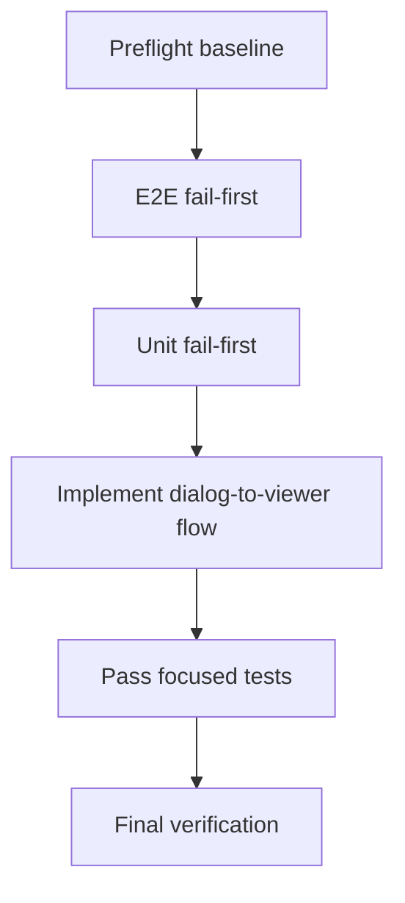

# Open Selected File In Window

## Current Baseline

- `src/main.ts` starts the app with one resolved markdown path and calls `controller.start(filePath)` exactly once during startup.
- `src/openFileDialog.ts` only shows the native picker; it does not provide a deterministic `defaultPath` and does not hand the selected file back to the running viewer flow.
- `src/viewerController.ts` can start watching an initial file, but it does not yet expose a dedicated "switch to a newly opened file" operation that closes the old watch before opening the next file.
- `wdio.conf.ts` launches e2e runs with `--test-file=./e2e/fixtures/test.md`, so the app already starts on a known markdown file during browser-driven tests.
- `e2e/features/open-file.feature` currently stops at dialog visibility and cancel behavior.

## Prompt

You are a build orchestration agent.

Your exact goal is to make `File -> Open` load the file selected in the native open dialog into the existing window.

Explicit non-goals:
- Do not open the selected file in a new window.
- Do not add recent-files state, history, or persistence.
- Do not add drag-and-drop behavior.
- Do not redesign the renderer or preload API shape unless a focused wiring change is required.
- Do not broaden the picker beyond single-file selection.
- Do not add non-macOS native-dialog automation.

## Critical Operating Rules

- Coordinate only; do not implement steps yourself when executing this plan.
- Use `todowrite` for progress tracking and keep exactly one step `in_progress` at a time.
- Delegate each step to a subagent with the exact step text from the todo list.
- Wait for evidence before marking any step complete.
- Use fail-first sequencing whenever behavior changes: write tests, run to confirm the expected failure, implement, rerun until green.
- Keep the scope tight to opening a selected markdown file in the current window.
- Treat native-dialog automation failures separately from product failures.

## Deterministic File-Picking Decision

Use this as the locked strategy for deterministic dialog selection in e2e:

1. Keep `wdio.conf.ts` launching the app with `--test-file=./e2e/fixtures/test.md`.
2. Make the production open dialog default to the currently opened file path.
3. Create a second markdown fixture beside it, `e2e/fixtures/open-dialog-target.md`.
4. In macOS AppleScript, avoid coordinate-based clicks.
5. Select the target file by navigating to the known fixture directory and filename, not by relying on Finder's previous location or row order.

Implementation intent for that strategy:
- Pass the active file path into `showOpenFileDialog` as `defaultPath`.
- In e2e, use `System Events` to target process `markdown-viewer`, wait for the Open dialog, invoke `Go to the folder` (`Command+Shift+G`) if needed, enter the absolute fixtures directory, confirm it, then enter `open-dialog-target.md` and confirm selection.
- Do not rely on the OS remembering the last folder.
- Do not rely on positional clicks or list ordering.

## Milestone Flow



## Exact Todo List

1. `Preflight / Step 1: Run baseline build and focused test commands`
2. `Preflight / Step 2: Check cucumber step collisions and fixture dependencies`
3. `Milestone 1 / Step 1: Refresh Open File e2e feature for selecting a file`
4. `Milestone 1 / Step 2: Implement deterministic macOS step definitions and fixture setup`
5. `Milestone 1 / Step 3: Run Open File e2e test and confirm expected failure`
6. `Milestone 2 / Step 1: Add unit tests for dialog result handling and viewer file switching`
7. `Milestone 2 / Step 2: Run focused unit tests and confirm expected failure`
8. `Milestone 3 / Step 1: Implement dialog defaultPath and selected-file open flow`
9. `Milestone 3 / Step 2: Pass focused unit tests`
10. `Milestone 3 / Step 3: Pass Open File e2e test`
11. `Final Verification / Step 1: Run focused unit and e2e verification`

Initial todo state:
- mark `Preflight / Step 1: Run baseline build and focused test commands` as `in_progress`
- mark every other todo as `pending`

## Required Execution Pattern

For every step, in order:

1. Update `todowrite` so only the current step is `in_progress`.
2. Delegate that exact step to one subagent.
3. Wait for the subagent to stop.
4. Review the returned evidence: files changed, commands run, observed result.
5. Mark the step `completed` only when the evidence matches the completion condition in this plan.
6. Move the next step to `in_progress`.

## Required Subagent Prompt Contract

Every delegated prompt must include these directives verbatim:

- `You are authorized for this single step only.`
- `Do not start the next step.`
- `When you finish, stop and report back with: step completed, files changed, commands run, observed result, failure category, and evidence location.`
- `Do not guess at failures; use evidence from logs, test output, and code inspection.`

## Baseline Commands

Run these before milestone work so later failures are easier to classify:

```bash
npm ci
npm run build
npm test -- --run src/openFileDialog.test.ts src/viewerController.test.ts src/applicationMenu.test.ts
npm run test:e2e -- --spec ./e2e/features/open-file.feature
```

Expected baseline interpretation:
- build should pass
- current focused unit tests should pass against the existing show-dialog-only behavior
- the current open-file e2e spec should pass or be skipped according to platform, then be replaced by the new fail-first scenario

## Preflight: Baseline And Harness Validation

### Step 1: Run baseline build and focused test commands

Run the exact Baseline Commands block above.

Completion condition:
- `npm ci` succeeds
- `npm run build` succeeds
- focused unit tests pass
- current open-file e2e command either passes on macOS or is skipped by platform gate
- command outputs are captured for later comparison

### Step 2: Check cucumber step collisions and fixture dependencies

Before rewriting the scenario, inspect the existing e2e suite for two things:
- no other step definition already uses the exact new Gherkin phrases below
- no other active feature depends on the literal body text that hooks write into `e2e/fixtures/test.md`

Required inspection targets:
- `e2e/steps/*.ts`
- `e2e/features/*.feature`
- `e2e/support/hooks.ts`
- `e2e/reports/wdio.log` for any recent open-file automation clues worth preserving

Fallback rule:
- if `e2e/reports/wdio.log` is absent on a clean checkout, treat that as non-blocking and record `inline output` as the evidence location for this preflight step

Completion condition:
- step phrase collisions are ruled out or called out explicitly
- fixture-content dependencies are ruled out or called out explicitly
- the evidence includes the exact search results used to rule out step collisions
- if either issue exists, stop and report it before changing test files

## Milestone 1: E2E test-first for opening a chosen file

### Step 1: Refresh Open File e2e feature for selecting a file

Update `e2e/features/open-file.feature` to assert user-visible file switching instead of dialog cancel behavior.

Use this exact Gherkin:

```gherkin
@macos
Feature: Open file dialog

  Scenario: File Open loads the selected markdown file into the current window
    Given the app is showing the initial test markdown document
    When the user clicks File Open
    And the user selects the deterministic target file in the Open File dialog
    Then the app shows the selected markdown document
```

Files expected:
- `e2e/features/open-file.feature`

Completion condition:
- the feature file contains the exact scenario text above

### Step 2: Implement deterministic macOS step definitions and fixture setup

Update the test harness to support the new scenario.

Required file targets:
- `e2e/steps/open-file.steps.ts`
- `e2e/support/hooks.ts`
- `e2e/fixtures/test.md`
- `e2e/fixtures/open-dialog-target.md`

Required behavior:
- `Given the app is showing the initial test markdown document`
  - assert `#app` contains the exact phrase `OPEN_FILE_INITIAL_FIXTURE`
- `When the user clicks File Open`
  - keep the existing menu-trigger approach via menu item id `file-open`
- `And the user selects the deterministic target file in the Open File dialog`
  - wait for the Open dialog to exist
  - navigate to the exact fixture directory deterministically
  - select `open-dialog-target.md` by filename, not by screen coordinates
  - fail with a clear environment error if AppleScript permissions block automation
- `Then the app shows the selected markdown document`
  - assert `#app` contains the exact phrase `OPEN_FILE_TARGET_FIXTURE`

Fixture rules:
- `e2e/fixtures/test.md` must contain the literal phrase `OPEN_FILE_INITIAL_FIXTURE`.
- `e2e/fixtures/open-dialog-target.md` must contain the literal phrase `OPEN_FILE_TARGET_FIXTURE`.
- `e2e/support/hooks.ts` is the canonical place to rewrite both markdown fixtures before each scenario.
- Do not duplicate fixture-writing logic in step files.

Completion condition:
- all step definitions match the exact Gherkin text
- both fixture files exist with stable, distinct content
- hooks own fixture reset/setup

### Step 3: Run Open File e2e test and confirm expected failure

Run:

```bash
npm run test:e2e -- --spec ./e2e/features/open-file.feature
```

Expected failure reason:
- the app shows the dialog but keeps rendering the original document because the selected file is not yet applied to the running viewer

Failure classification:
- Product failure: dialog selection succeeds, but the page still shows the initial fixture phrase.
- Environment failure: packaging fails, `osascript` access is denied, process targeting fails, or the dialog cannot be automated.

Completion condition:
- the failure output is captured and classified as `product` or `environment`
- `e2e/reports/wdio.log` or equivalent command output is referenced in the evidence
- do not continue until the failure is clearly attributed

## Milestone 2: Unit test-first for selected-file handling

### Step 1: Add unit tests for dialog result handling and viewer file switching

Update these test files:
- `src/openFileDialog.test.ts`
- `src/viewerController.test.ts`
- `src/openFileFlow.test.ts`

Required orchestration test location:
- create `src/openFileFlow.ts` plus `src/openFileFlow.test.ts` for the menu callback flow instead of trying to unit-test the full Electron bootstrap in `src/main.ts`
- keep `src/main.ts` as a thin wiring layer that calls the tested helper

Required assertions:

For `src/openFileDialog.test.ts`:
- `showOpenFileDialog` accepts a deterministic `defaultPath` input and forwards it to `dialog.showOpenDialog`
- the options still include `properties: ['openFile']`
- the options still include the markdown and all-files filters in the same order
- the helper returns the selected path payload unchanged

For `src/viewerController.test.ts`:
- opening a new file closes the previous watch handle before starting a new watch
- opening a new file reads and renders the newly selected file
- opening a new file updates `baseHref` to the selected file directory
- opening a new file publishes the new rendered document

For `src/openFileFlow.test.ts`:
- canceling the dialog is a no-op: the current document remains unchanged and no controller switch method is called
- selecting a path calls the controller switch method with the selected file
- the helper passes the current active file path into `showOpenFileDialog` as `defaultPath`
- dialog errors surface to the caller so the existing `main.ts` error logging path still works

Preferred design target:
- add a dedicated controller method such as `openFile(filePath)` or `switchFile(filePath)` instead of reusing startup-only behavior implicitly
- prefer a small orchestration helper that receives its dependencies as arguments: current-path getter, dialog opener, and controller switch method

Completion condition:
- focused unit tests describe the intended behavior without implementation guessing

### Step 2: Run focused unit tests and confirm expected failure

Run:

```bash
npm test -- --run src/openFileDialog.test.ts src/openFileFlow.test.ts src/viewerController.test.ts src/applicationMenu.test.ts
```

Expected failure reasons:
- dialog helper does not yet accept or forward `defaultPath`
- viewer controller does not yet expose selected-file switching behavior
- orchestration helper does not yet apply the returned file path

Completion condition:
- failing assertions point at the missing behavior above, not unrelated infrastructure

## Milestone 3: Implement dialog-to-viewer open flow

### Step 1: Implement dialog defaultPath and selected-file open flow

Update these code paths:
- `src/openFileDialog.ts`
- `src/openFileFlow.ts`
- `src/main.ts`
- `src/viewerController.ts`
- optionally `src/contracts.ts` only if a type needs to move into shared contract space

Implementation requirements:
- prefer `ViewerController` as the source of truth for the active file path; if needed, add a focused getter rather than duplicating mutable path state in `main.ts`
- `showOpenFileDialog` must accept the current active file path and pass it as `defaultPath`
- keep `dialog.showOpenDialog` to a single options object; do not add a parent window argument
- after dialog resolution:
  - if `canceled` is `true` or `filePaths[0]` is missing, exit without changing the current document
  - if a file path is returned, switch the existing window to that file in place
- the file switch must close the previous watcher before attaching a new watcher
- the renderer update must continue using the existing publish path (`IPC_HTML_UPDATED`) so the window refreshes without reopening
- preserve the existing single-window behavior

Completion condition:
- selecting a file routes all the way from menu -> dialog result -> controller -> published document update

### Step 2: Pass focused unit tests

Run:

```bash
npm test -- --run src/openFileDialog.test.ts src/openFileFlow.test.ts src/viewerController.test.ts src/applicationMenu.test.ts
```

Completion condition:
- all focused unit tests pass

### Step 3: Pass Open File e2e test

Run:

```bash
npm run test:e2e -- --spec ./e2e/features/open-file.feature
```

Completion condition:
- on macOS, the app visibly switches from the initial fixture phrase to the target fixture phrase after dialog selection

## Deterministic AppleScript Guidance

Use these rules when implementing the native-dialog e2e step:

- Target process name: `markdown-viewer`
- Wait up to 10 seconds for the dialog to appear before interacting
- Prefer exact filename entry over row selection
- If `Go to the folder` is required, enter the absolute path to `e2e/fixtures`
- Press Return only after the target filename is populated
- Do not use x/y coordinates
- Do not rely on the last-opened folder
- Keep dialog cleanup logic in one canonical place if a failure leaves the dialog open

If a cleanup helper is needed after partial dialog interaction, add it only in `e2e/support/hooks.ts`.

## Environment Failure Handling

- If `npm run package` fails, stop the step immediately, classify it as `environment`, attach the failing build output, and do not attempt product fixes.
- If AppleScript permission is denied, stop the step immediately, classify it as `environment`, and report the run as blocked until a human grants permission.
- If process targeting or dialog interaction fails for a reason that looks transient, allow one rerun after collecting the first failure log.
- Do not exceed one rerun for any environment failure.
- Do not continue from Milestone 1 Step 3 to Milestone 2 unless the Step 3 failure is a confirmed `product` failure.
- If final e2e verification is environment-blocked after unit tests are green, stop and report `environment-blocked final verification`; do not claim full completion.

## Evidence Template

For every completed step, require this exact evidence format from the subagent:

1. `step completed`: yes/no
2. `files changed`: comma-separated paths
3. `commands run`: exact commands or `none`
4. `observed result`: one concise sentence
5. `failure category`: `product`, `environment`, or `none`
6. `evidence location`: file path or `inline output`

## Final Verification

Run these exact commands at the end:

```bash
npm run build
npm test -- --run src/openFileDialog.test.ts src/openFileFlow.test.ts src/viewerController.test.ts src/applicationMenu.test.ts
npm run test:e2e -- --spec ./e2e/features/open-file.feature
```

Record whether the final e2e run executed on macOS or was skipped by platform gating.

If the final e2e command is skipped by platform gating, record:
- `failure category: none`
- `evidence location: inline output`
- observed result text that explicitly says `skipped by platform gate`

## Acceptance Criteria

- `File -> Open` still shows the native single-file picker.
- The picker opens from a deterministic path by using the currently active file path as `defaultPath`.
- Selecting `e2e/fixtures/open-dialog-target.md` replaces the document shown in the existing window.
- Canceling or dismissing the dialog leaves the current document unchanged.
- Switching files closes the old watcher and starts watching the newly selected file.
- The updated document publish path continues to use the existing renderer update mechanism.
- macOS e2e coverage selects the file deterministically without coordinate clicks or reliance on remembered OS state.
- Focused unit tests and the open-file e2e scenario pass.
