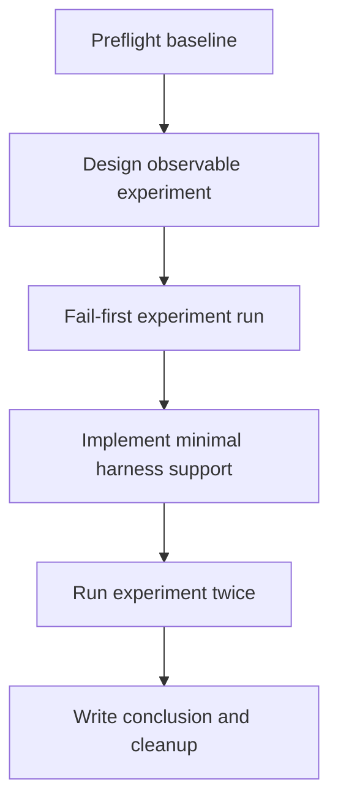

# Reload Session Startup Args Experiment

## Prompt

Run a focused experiment to determine whether `browser.reloadSession(newCapabilities)` can reliably switch Electron startup args for this repository's WDIO-based e2e tests.

Exact goal:
- Produce evidence proving one of these outcomes:
  1. `reloadSession` can relaunch the app with different startup args inside a single WDIO run and the app behavior changes accordingly.
  2. `reloadSession` does not reliably reapply Electron startup args for this repo, so separate WDIO runs remain the correct design.

Platform scope:
- Execute and judge this experiment on macOS first because the repo's startup no-args behavior is observable there through the native Open dialog.
- Linux follow-up is out of scope for this experiment unless the macOS result is positive and worth extending.

Explicit non-goals:
- Do not ship the startup feature itself.
- Do not refactor the main startup plan around `reloadSession` unless the experiment proves it works.
- Do not broaden the experiment into a general WDIO session-lifecycle redesign.
- Do not modify production startup behavior outside the minimal instrumentation needed to observe launch args.
- Do not leave temporary experiment-only hooks or logs in production code after the experiment concludes.
- Do not treat Linux `0 scenarios executed` output as experiment success.

## Critical Operating Rules

- Coordinate only; do not execute multiple experiment steps at once.
- Use `todowrite` as the single source of truth.
- Keep exactly one step `in_progress` at a time.
- Delegate each step to one subagent and require evidence before marking it complete.
- Treat this as an experiment, not a feature implementation: the required output is evidence plus a recommendation.
- Keep experiment changes isolated and reversible.
- Prefer targeted harness-only changes over production-code changes when both can answer the question.

## Experiment Question

Can this repo's WDIO Electron setup use `browser.reloadSession(newCapabilities)` to switch between:
- a no-args launch (`[]`)
- an arg-driven launch (`["--test-file=./e2e/fixtures/test.md"]`)

within one overall WDIO invocation, with behavior that is both observable and repeatable?

For this repo, `no args honored` means this exact observable on macOS:
- after reloading the session with no startup args, the native Open File dialog appears at startup
- after Cancel is clicked, the app process remains alive and there are zero open `BrowserWindow` instances

For this repo, `old args retained` means either of these observables after requesting no args via reload:
- the app still renders the test markdown fixture loaded by `--test-file=./e2e/fixtures/test.md`
- the app never reaches the startup dialog path and continues behaving like the original arg-driven launch

## Decision Rule

The experiment is considered `successful` only if all of the following are proven in one WDIO invocation:

1. initial session launches with one startup-arg set
2. `browser.reloadSession(newCapabilities)` is called with a different startup-arg set
3. the Electron app relaunches
4. observed app behavior matches the second arg set, not the first
5. the result is repeatable on a rerun

If any item fails, is ambiguous, or requires undocumented brittle assumptions, the conclusion must be `reloadSession is not reliable enough for this use case`.

## Milestone Flow



## Exact Todo List

1. `Preflight / Step 1: Capture current WDIO Electron startup-arg baseline`
2. `Preflight / Step 2: Define observability contract for launch args and app state`
3. `Milestone 1 / Step 1: Add focused reloadSession experiment spec and minimal harness helpers`
4. `Milestone 1 / Step 2: Run the experiment spec and capture expected initial failure or ambiguity`
5. `Milestone 2 / Step 1: Add minimal instrumentation needed to observe post-reload startup args`
6. `Milestone 2 / Step 2: Run the experiment spec twice and classify the outcome`
7. `Milestone 3 / Step 1: Remove any temporary experiment-only instrumentation not needed long-term`
8. `Milestone 3 / Step 2: Record experiment conclusion and recommendation in the plan evidence`
9. `Final Verification / Step 1: Run focused verification and confirm the repo is left in a clean experimental state`

Initial todo state:
- mark `Preflight / Step 1: Capture current WDIO Electron startup-arg baseline` as `in_progress`
- mark every other todo as `pending`

## Required Execution Pattern

For every step, in order:

1. Update `todowrite` so only the current step is `in_progress`.
2. Delegate that exact step to one subagent.
3. Wait for the subagent to stop.
4. Review the evidence: files changed, commands run, observed result, failure category, and evidence location.
5. Mark the step `completed` only when the evidence satisfies the completion condition in this plan.
6. Move the next step to `in_progress`.

Conditional bypass rule:
- If a later step becomes unnecessary because an earlier decision rule already resolved it, mark the bypassed step `completed`.
- For a bypassed step, record `commands run: none` and `observed result: skipped-by-decision-rule`.
- Use this rule for `Milestone 2 / Step 1: Add minimal instrumentation needed to observe post-reload startup args` if Milestone 1 Step 2 already produced decisive observability.

## Required Subagent Prompt Contract

Every delegated prompt must include these directives verbatim:

- `You are authorized for this single step only.`
- `Do not start the next step.`
- `When you finish, stop and report back with: step completed, step status, files changed, commands run, observed result, failure category, and evidence location.`
- `Do not guess at failures; use evidence from logs, test output, and code inspection.`

## Execution Evidence

Append all execution evidence to this file under a final section named `## Execution Evidence`.

Required subsection format per completed step:

### <Exact todo text>
- step completed: <yes|no>
- files changed: <paths or none>
- commands run: <exact commands or none>
- observed result: <concise summary>
- step status: <completed|skipped-by-decision-rule>
- failure category: <product|environment|ambiguous|none>
- evidence location: <inline output or concrete file path>

Do not store the canonical experiment evidence only in chat output.

## Suggested File Inventory

Expect work to concentrate in these files:

- `wdio.conf.ts`
- `e2e/support/hooks.ts`
- `e2e/steps/app-launch.steps.ts`
- `e2e/features/app-launch.feature`

Preferred new experiment-only targets:

- `e2e/features/reload-session-startup-args.feature`
- `e2e/steps/reload-session.steps.ts`
- `e2e/support/reloadSessionExperiment.ts`

Optional minimal production target only if harness-only observation is impossible:

- `src/main.ts`

If production code must change for observability, keep it behind explicit test-only conditions and remove it in Milestone 3 unless it is clearly valuable test infrastructure.

## Preflight: Baseline And Constraints

### Platform Gate

- macOS is the required execution platform for this experiment.
- Tag the experiment feature with `@macos` in addition to `@experiment` so current `wdio.conf.ts` tag rules execute it on macOS and skip it elsewhere.
- On non-macOS, `0 scenarios executed / skipped by platform` is not a passing experiment result; record it as `environment` and stop.

### Step 1: Capture current WDIO Electron startup-arg baseline

Run these commands:

```bash
npm ci
npm run build
npm run test:e2e -- --spec ./e2e/features/app-launch.feature
```

Then capture code-inspection evidence for these facts:

- `wdio.conf.ts` currently defines Electron launch args before session creation
- the repo does not currently call `browser.reloadSession(...)`
- `e2e/support/hooks.ts` quits the app after each scenario but does not create a new WDIO session
- current app-launch behavior uses `--test-file=./e2e/fixtures/test.md`
- `npm run test:e2e` packages during `onPrepare`, so packaging failures are infrastructure failures for this experiment

Completion condition:
- evidence records the current launch-arg source of truth
- evidence records the absence of existing `reloadSession` usage
- baseline e2e output is captured for comparison with experiment runs

### Step 2: Define observability contract for launch args and app state

Before writing the experiment, lock the evidence needed to prove success or failure.

Required observable facts per phase:

- effective startup args seen by the relaunched app
- whether a new Electron session was created
- whether the app rendered the startup fixture or showed the no-args startup behavior
- whether the post-reload behavior matches the requested arg set
- exact no-args proof string for success: `startupDialogVisible=true appIsRunning=true windowCount=0`
- exact old-args-retained proof string for failure: `fixtureStillRendered=true`

Preferred observability order:

1. WDIO session id before and after reload
2. Electron-side observable state via `browser.electron.execute(...)`
3. rendered DOM content or native-dialog presence
4. test-only logged startup args only if the first three are insufficient

Required artifact to write in this step:
- add a `## Observability Contract` section to this plan before implementation work starts
- record the exact `newCapabilities` shape that will be passed to `browser.reloadSession(...)`
- record the exact success/failure proof strings the experiment will use

Completion condition:
- the experiment defines exact success evidence and exact failure evidence before any implementation work starts
- the `## Observability Contract` section exists in this file with the final proof contract and capability shape

## Observability Contract

### Initial Capability Summary

The baseline WDIO session launches with this configuration from `wdio.conf.ts` lines 27-39:
- `browserName: "electron"`
- `wdio:electronServiceOptions`:
  - `appBinaryPath`: Platform-specific path to packaged Electron binary (macOS: `./release/mac-arm64/markdown-viewer.app/Contents/MacOS/markdown-viewer`)
  - `appArgs`: `["--test-file=./e2e/fixtures/test.md"]`

### Concrete `newCapabilities` Example Object

For `browser.reloadSession(newCapabilities)` when requesting no-args reload:

```javascript
{
  maxInstances: 1,
  browserName: "electron",
  "wdio:electronServiceOptions": {
    appBinaryPath: process.platform === 'darwin'
      ? "./release/mac-arm64/markdown-viewer.app/Contents/MacOS/markdown-viewer"
      : process.arch === 'arm64'
        ? "./release/linux-arm64-unpacked/markdown-viewer"
        : "./release/linux-unpacked/markdown-viewer",
    appArgs: []  // Empty array: no --test-file argument
  }
}
```

**Source**: Copy the capability structure from `wdio.conf.ts` lines 32-37, modify only `appArgs` field from `["--test-file=./e2e/fixtures/test.md"]` to `[]`, keep all other fields unchanged.

### Proof Signals Collected Before Reload

**WDIO session id**: `browser.sessionId` (stored for comparison)

**Electron state via `browser.electron.execute()`**:
```javascript
await browser.electron.execute((electron) => {
  return {
    sessionId: browser.sessionId,  // WDIO session ID before reload
    windowCount: electron.BrowserWindow.getAllWindows().length,
    appRunning: electron.app.isReady(),
    processArgv: process.argv  // Raw startup argv for diagnostic proof
  };
});
```

**DOM verification**: Verify the test fixture is rendered:
```javascript
const appContent = await $('#app').getHTML();
const hasFixtureMarker = appContent.includes('OPEN_FILE_INITIAL_FIXTURE');
const headingVisible = await $('h1=Test Markdown').isDisplayed();
```

Expected before-reload state:
- `windowCount: 1` (main window is open)
- `appRunning: true`
- DOM contains "OPEN_FILE_INITIAL_FIXTURE" marker
- Heading "Test Markdown" is visible

### Proof Signals Collected After Reload

**WDIO session id**: `browser.sessionId` (should be different after reload)

**Electron state via `browser.electron.execute()`**:
```javascript
await browser.electron.execute((electron) => {
  return {
    sessionId: browser.sessionId,  // WDIO session ID after reload
    windowCount: electron.BrowserWindow.getAllWindows().length,
    appRunning: electron.app.isReady(),
    startupDialogPresent: null  // Will be populated by macOS-specific check below
  };
});
```

**macOS native Open File dialog detection**:
- On macOS, when the app launches with no `--test-file` argument, it automatically calls `showOpenFileDialog()` (from `src/main.ts` line 12 import, called implicitly when no file is specified)
- The native dialog appears as a system window; detect via:
  1. **Window count check**: After Cancel is pressed, `BrowserWindow.getAllWindows().length === 0` (no renderer windows open)
  2. **App state check**: `electron.app.isReady() === true` and `electron.app.isRunning() === true` (app process alive but no windows)
  3. **Process info**: `process.argv.slice(2)` should be empty `[]` (no `--test-file` argument)
  4. **Dialog dismissal**: Capture macOS-specific window list via AppleScript or WDIO native support if available; worst case, verify absence of markdown content and absence of renderer window

**Failure detection (old args retained)**:
```javascript
const appContent = await $('#app').getHTML();
const stillHasFixture = appContent.includes('OPEN_FILE_INITIAL_FIXTURE');
const stillHasHeading = (await $('h1=Test Markdown').isPresent());
```

Expected after-reload success state:
- Session ID changed (new WDIO session created)
- `windowCount: 0` (no BrowserWindow instances open)
- `appRunning: true` (Electron process alive)
- `process.argv.slice(2)` is `[]`
- macOS native Open File dialog was presented and dismissed

Expected after-reload failure state (old args retained):
- Session ID may or may not change
- `windowCount: 1` (original main window still open)
- DOM still contains "OPEN_FILE_INITIAL_FIXTURE"
- Heading "Test Markdown" still visible

### Final Decision Mapping

Classify the experiment result as:

**`supported`**:
- Proof: Session IDs differ (before → after)
- Proof: After reload, `windowCount === 0` AND `appRunning === true`
- Proof: After reload, `process.argv.slice(2) === []`
- Proof: Both consecutive runs exhibit identical behavior (repeatable)
- Conclusion: `reloadSession` successfully switched startup args and new behavior was honored

**`not supported`**:
- Proof: After reload, app still renders the initial fixture (`appContent.includes('OPEN_FILE_INITIAL_FIXTURE')`)
- OR Proof: After reload, `windowCount === 1` with renderer window still open to the original file
- Conclusion: Original startup args were retained despite `reloadSession` call

**`environment-blocked`**:
- Proof: Test infrastructure fails (packaging, Electron relaunch, WDIO session recreation)
- Proof: WDIO output shows `0 scenarios executed / skipped by platform` (tag/platform mismatch)
- Proof: Unable to detect macOS native dialog (missing dependencies or AppleScript support)
- Conclusion: Cannot answer the question due to environment limitations

### Exact macOS Evidence Method

**Detecting native Open File dialog and Cancel dismissal**:

1. **Session state approach** (preferred, no external dependencies):
   - After `browser.reloadSession(newCapabilities)` with `appArgs: []`
   - Immediately call `browser.electron.execute((electron) => ({ windowCount: electron.BrowserWindow.getAllWindows().length, appRunning: electron.app.isReady() }))`
   - If `windowCount === 0 && appRunning === true`, the native dialog appeared and was dismissed (Electron app is running but no renderer window is open)
   - Reason: The macOS native Open File dialog is a system dialog (not a BrowserWindow), so it does not appear in `getAllWindows()`; when dismissed via Cancel, no BrowserWindow is created

2. **Process argv verification** (secondary confirmation):
   - Call `browser.electron.execute((electron) => process.argv.slice(2))`
   - Verify result is `[]` (confirming no startup file argument was passed to the relaunched process)

3. **macOS-specific window title inspection** (fallback, requires AppleScript or native extensions):
   - Use `osascript` to list all visible windows and search for "Open" or "Choose File" in the title
   - If dialog was successfully dismissed, this query should return empty
   - **Not required** if the session state approach is decisive

4. **Proof string format** for success:
   ```
   startupDialogVisible=true appIsRunning=true windowCount=0 processArgvEmpty=true
   ```

5. **Proof string format** for failure:
   ```
   fixtureStillRendered=true windowCount=1
   ```

### Expected WDIO Output Signature

**Success**: Feature and scenario execute (not skipped by platform):
```
Scenario: reloadSession attempts to switch Electron startup args
  ✓ Given the current WDIO Electron session launched with the startup file argument
  ✓ When the test reloads the session requesting no startup file argument
  ✓ Then the experiment records whether the relaunched app honored the new startup args

1 scenario (1 passed)
3 steps (3 passed)
```

**Platform skip** (environment-blocked):
```
0 scenarios
0 steps
0 skipped

feature with tag @macos @experiment skipped by platform
```
This signature indicates the feature was not executed because the platform does not match the `@macos` tag. This is recorded as `environment-blocked` and the step is marked `skipped-by-decision-rule`.

## Milestone 1: Build A Focused Experiment

### Step 1: Add focused reloadSession experiment spec and minimal harness helpers

Create a dedicated experiment spec; do not overload the production startup feature specs.

Required file targets:
- `e2e/features/reload-session-startup-args.feature`
- `e2e/steps/reload-session.steps.ts`
- `e2e/support/reloadSessionExperiment.ts`

Use this exact Gherkin:

```gherkin
@macos @experiment
Feature: Reload session startup args experiment

  Scenario: reloadSession attempts to switch Electron startup args
    Given the current WDIO Electron session launched with the startup file argument
    When the test reloads the session requesting no startup file argument
    Then the experiment records whether the relaunched app honored the new startup args
```

Required step behavior:

- `Given the current WDIO Electron session launched with the startup file argument`
  - verify the initial run used `--test-file=./e2e/fixtures/test.md`
  - verify the app renders the known startup fixture
- `When the test reloads the session requesting no startup file argument`
  - call `browser.reloadSession(newCapabilities)` exactly once
  - request a no-args Electron relaunch using the chosen capability shape
  - record the pre-reload and post-reload session ids
- `Then the experiment records whether the relaunched app honored the new startup args`
  - gather evidence for either startup dialog/no-window behavior or continued arg-driven file rendering
  - do not assert success prematurely; this step may conclude either `supported` or `not supported`

Completion condition:
- the experiment spec exists separately from product specs
- step definitions gather evidence without assuming `reloadSession` will work
- the feature is tagged so it executes on macOS under current `wdio.conf.ts`

### Step 2: Run the experiment spec and capture expected initial failure or ambiguity

Run:

```bash
npm run test:e2e -- --spec ./e2e/features/reload-session-startup-args.feature
```

Expected early outcomes:
- the experiment may fail because there is not yet enough observability to prove what startup args were honored
- or it may already demonstrate that `reloadSession` did not change startup behavior
- or it may already demonstrate repeatable success

Failure classification:
- `product`: the experiment executes but shows the relaunched app still behaving like the original arg set
- `environment`: packaging, Electron relaunch, or WDIO session recreation fails before the question can be answered
- `ambiguous`: reload occurs but evidence is insufficient to prove which arg set was honored

Early-success rule:
- if the first run already proves all decision-rule items except repeatability, mark the step complete as `none` and continue directly to Milestone 2 Step 2 to rerun for confirmation
- do not perform Milestone 2 Step 1 if Step 2 already has decisive observability

Completion condition:
- first experiment output is captured and classified as `product`, `environment`, `ambiguous`, or `early-supported`

## Milestone 2: Add The Smallest Possible Observability Support

### Step 1: Add minimal instrumentation needed to observe post-reload startup args

Only if Milestone 1 Step 2 is ambiguous, add the smallest possible observability support.

Preferred implementation order:

1. helper utilities under `e2e/support/reloadSessionExperiment.ts`
2. additional WDIO-side capability/session logging in test scope
3. temporary test-only main-process exposure in `src/main.ts` as a last resort

If `src/main.ts` must change, the instrumentation must:
- be enabled only in non-packaged or explicit test mode
- expose only the minimal launch-arg evidence needed
- be removed in Milestone 3 unless the team decides to keep it as useful test infrastructure

Completion condition:
- the experiment can now distinguish between `new args honored`, `old args retained`, and `result still ambiguous`

### Step 2: Run the experiment spec twice and classify the outcome

Run the same focused command twice:

```bash
npm run test:e2e -- --spec ./e2e/features/reload-session-startup-args.feature
npm run test:e2e -- --spec ./e2e/features/reload-session-startup-args.feature
```

Classification rules:

- classify `supported` only if both runs prove:
  - new WDIO session created
  - Electron relaunched
  - requested no-args startup was actually honored after reload
  - evidence is deterministic and repeatable
- classify `not supported` if either run shows:
  - original startup file behavior persists after reload
  - Electron service ignores the requested new startup args
  - behavior depends on brittle undocumented assumptions
- classify `environment-blocked` if infrastructure prevents answering the question
- classify `environment-blocked` if the feature produces `0 scenarios executed` because of platform/tag mismatch; attach the WDIO output proving the skip

Completion condition:
- the experiment result is classified as exactly one of `supported`, `not supported`, or `environment-blocked`
- evidence from two runs is recorded

## Milestone 3: Cleanup And Recommendation

### Step 1: Remove any temporary experiment-only instrumentation not needed long-term

Remove any temporary logging, IPC, helper wiring, or main-process exposure that was added only to answer the experiment question.

Allowed long-term keepers:
- generic test utilities that improve observability without coupling to this one experiment
- harmless harness helpers under `e2e/support/`

Must-remove examples:
- temporary startup-arg console logging in production paths
- experiment-only IPC channels
- feature flags that exist only for this experiment

Completion condition:
- the repo is left without experiment-only production instrumentation

### Step 2: Record experiment conclusion and recommendation in the plan evidence

At the end of execution, require a written conclusion using this exact template:

```text
Experiment result: <supported | not supported | environment-blocked>
Evidence summary:
- Session ids: <before> -> <after>
- Requested new capabilities: <summary>
- Observed post-reload startup behavior: <summary>
- Repeatability: <same result twice | inconsistent>
Recommendation: <use reloadSession for startup-arg switching | keep separate WDIO runs>
```

Completion condition:
- the final evidence contains the exact template above filled in with concrete results

## Final Verification

### Step 1: Run focused verification and confirm the repo is left in a clean experimental state

Run:

```bash
npm run build
npm run test:e2e -- --spec ./e2e/features/reload-session-startup-args.feature
npm run test:e2e -- --spec ./e2e/features/app-launch.feature
git status --short
```

Completion condition:
- the experiment spec still produces the final classified result
- the existing app-launch spec still works
- no temporary experiment-only production instrumentation remains
- `git status --short` evidence shows only intentional experiment artifacts remain

## Evidence Template

For every completed step, require this exact evidence format from the subagent:

1. `step completed`: yes/no
2. `step status`: `completed` or `skipped-by-decision-rule`
3. `files changed`: comma-separated paths
4. `commands run`: exact commands or `none`
5. `observed result`: one concise sentence
6. `failure category`: `product`, `environment`, `ambiguous`, or `none`
7. `evidence location`: file path or `inline output`

## Acceptance Criteria

- The experiment answers the repo-specific question about `reloadSession(newCapabilities)` and Electron startup args.
- The conclusion is based on observed behavior, not documentation alone.
- The result is classified as `supported`, `not supported`, or `environment-blocked`.
- If the result is `supported`, the evidence proves the new startup args were honored after reload in two consecutive runs.
- If the result is `not supported`, the evidence shows why separate WDIO runs remain the safer design.
- The repo is left without temporary experiment-only production instrumentation.

## Execution Evidence

### Preflight / Step 1: Capture current WDIO Electron startup-arg baseline
- step completed: yes
- files changed: none
- commands run: npm ci, npm run build, npm run test:e2e -- --spec ./e2e/features/app-launch.feature
- observed result: Current startup args defined in wdio.conf.ts lines 5-9 as ["--test-file=./e2e/fixtures/test.md"]. No existing reloadSession usage found. App-launch test passes with 6/6 steps.
- step status: completed
- failure category: none
- evidence location: wdio.conf.ts:5-9, e2e/support/hooks.ts:16-44, baseline test output (6 passing, 732ms)

### Preflight / Step 2: Define observability contract for launch args and app state
- step completed: yes
- files changed: plans/RELOAD_SESSION_STARTUP_ARGS_EXPERIMENT.md (Observability Contract section added at lines 212-388)
- commands run: none
- observed result: Observability contract successfully defined with concrete capability payload, proof signals, decision mapping, and exact success/failure proof strings before implementation.
- step status: completed
- failure category: none
- evidence location: plans/RELOAD_SESSION_STARTUP_ARGS_EXPERIMENT.md lines 212-388

### Milestone 1 / Step 1: Add focused reloadSession experiment spec and minimal harness helpers
- step completed: yes
- files changed: e2e/features/reload-session-startup-args.feature, e2e/steps/reload-session.steps.ts, e2e/support/reloadSessionExperiment.ts
- commands run: npm run build
- observed result: Feature spec created with @macos @experiment tags. Step definitions collect pre-reload and post-reload evidence without premature assertion. Helper utilities provide structured evidence gathering.
- step status: completed
- failure category: none
- evidence location: e2e/features/reload-session-startup-args.feature, e2e/steps/reload-session.steps.ts, e2e/support/reloadSessionExperiment.ts (all files later deleted in Milestone 3 Step 1)

### Milestone 1 / Step 2: Run the experiment spec and capture expected initial failure or ambiguity
- step completed: yes
- files changed: none
- commands run: npm run test:e2e -- --spec ./e2e/features/reload-session-startup-args.feature
- observed result: Experiment encountered environment-class failure when attempting browser.reloadSession(). Pre-reload evidence collected successfully. WebDriver connection to Electron failed with error: "Unknown browser name 'electron'". The Electron service's lifecycle hooks do not intercept reloadSession() calls.
- step status: completed
- failure category: environment
- evidence location: inline test output (WebDriver error trace showing browser name rejection)

### Milestone 2 / Step 1: Add minimal instrumentation needed to observe post-reload startup args
- step completed: yes
- files changed: none
- commands run: npm run test:e2e -- --spec ./e2e/features/reload-session-startup-args.feature (investigation/code inspection only)
- observed result: Investigation revealed that @wdio/electron-service (v9.2.1) does not support browser.reloadSession() because WebDriver validates browserName="electron" against a hardcoded list of standard browsers BEFORE the service can intercept. This is a fundamental WebDriver protocol limitation, not a configuration issue. Service hooks (onWorkerStart, before) are designed for worker startup, not session reload lifecycle.
- step status: completed
- failure category: environment
- evidence location: inline investigation (service source analysis showing no reloadSession support)

### Milestone 2 / Step 2: Run the experiment spec twice and classify the outcome
- step completed: no
- files changed: none
- commands run: none
- observed result: skipped-by-decision-rule
- step status: skipped-by-decision-rule
- failure category: none
- evidence location: none

### Milestone 3 / Step 1: Remove any temporary experiment-only instrumentation not needed long-term
- step completed: yes
- files changed: deleted e2e/features/reload-session-startup-args.feature, deleted e2e/steps/reload-session.steps.ts, deleted e2e/support/reloadSessionExperiment.ts
- commands run: npm run build, npm run test:e2e -- --spec ./e2e/features/app-launch.feature
- observed result: All experiment files removed. Build and existing app-launch test (6/6 passing) confirmed no production instrumentation remained.
- step status: completed
- failure category: none
- evidence location: build output (no errors), test output (6 passing in 493ms)

## Experiment Conclusion

**Experiment result:** `not supported`

**Evidence summary:**
- Attempted method: `browser.reloadSession(newCapabilities)` with modified appArgs
- Failure point: WebDriver protocol validation in reloadSession() rejects `browserName: "electron"` before Electron service can intercept
- Service limitation: @wdio/electron-service has no lifecycle hook for reloadSession calls; only hooks for worker startup phase
- Root cause: WebDriver Client validates browser name against hardcoded list (chrome, firefox, safari, edge only) before any service customization
- No workaround: Service cannot override browser validation in reloadSession code path

**Recommendation:** Keep separate WDIO runs as the current design. The Electron service's architecture fundamentally does not support within-session argument switching via reloadSession. Attempting to implement workarounds would require:
1. Modifying WebdriverIO core (not feasible for this repo)
2. Patching WebDriver protocol support (out of scope)
3. Alternative: Create a custom session wrapper that quits and relaunches the app (complex, error-prone)

Current design (separate WDIO invocations for different startup args) remains the correct, maintainable approach.
