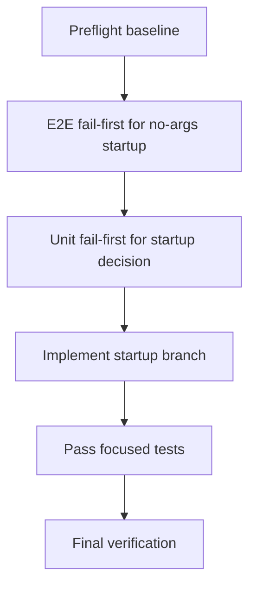
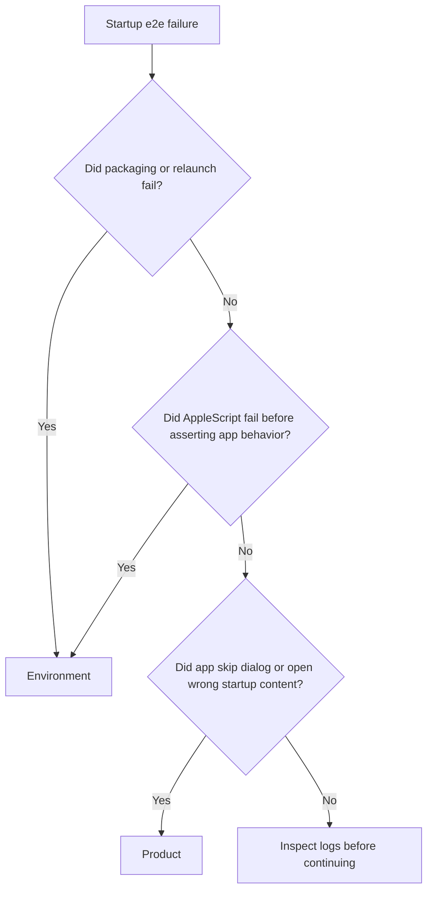

# Startup Open Behavior

## Current Baseline

- `src/main.ts` resolves a startup path from CLI args and falls back to `README.md` when no usable arg is present.
- `src/openFileDialog.ts` already uses `dialog.showOpenDialog(options)` with no parent window argument, so the existing dialog behavior is already aligned with the standalone-dialog requirement.
- `src/openFileFlow.ts` is currently menu-oriented and assumes there is already an active file to use as `defaultPath`.
- `wdio.conf.ts` always launches the packaged app with `--test-file=./e2e/fixtures/test.md`, so the current e2e harness cannot exercise the no-args startup path without targeted harness work.
- `e2e/features/app-launch.feature` currently validates only the provided-arg startup path because the harness always injects the test file.
- `src/main.ts` currently creates the `BrowserWindow` before startup file resolution, so startup cancellation presently still leaves a window open.

## Prompt

Create startup behavior where the app opens a standalone native Open File dialog when no startup filename arg is provided, and opens the provided file directly when a filename arg is present.

Exact goal:
- Replace the current `README.md` fallback with startup-time branching: `arg provided -> open that file`, `no arg provided -> show standalone Open File dialog`.

Explicit non-goals:
- Do not preserve the old `README.md` fallback.
- Do not add recent-files persistence, MRU menus, or remembered startup state.
- Do not attach the startup dialog to a `BrowserWindow`.
- Do not redesign the renderer, menu flow, or preload API beyond focused startup wiring needed for this feature.
- Do not broaden picker scope beyond single-file selection.
- Do not add Linux-specific native dialog automation beyond what is already required for existing test coverage.

## Critical Operating Rules

- Coordinate only; do not execute milestone steps yourself when following this plan.
- Use `todowrite` as the single source of truth for progress.
- Keep exactly one todo `in_progress` at a time.
- Delegate exactly one todo step at a time to a subagent and wait for evidence before marking it complete.
- Use fail-first sequencing whenever a behavior change is under test: write tests, run to confirm the expected failure, implement, rerun until green.
- Keep failures classified as either `product` or `environment` when test infrastructure can fail before behavior is exercised.
- Do not reintroduce any default-file fallback after the startup decision is changed.

## Locked Product Decisions

- Treat any non-flag CLI arg resolved by the existing arg parser as the startup filename candidate.
- Keep support for the existing `--test-file=` harness path because current e2e infrastructure uses it.
- If a startup filename arg is present, skip showing the startup dialog entirely.
- If no startup filename arg is present, call the existing standalone dialog helper from the main process before creating any `BrowserWindow`.
- The startup dialog must use `dialog.showOpenDialog(options)` with no `BrowserWindow` argument.
- If the startup dialog is canceled or returns no file path, do not fall back to `README.md`, do not create a `BrowserWindow`, and keep the app process running with zero open windows.

## Milestone Flow



## Exact Todo List

1. `Preflight / Step 1: Capture current startup baseline, arg precedence, and harness dependencies`
2. `Preflight / Step 2: Verify macOS AppleScript automation readiness`
3. `Milestone 1 / Step 1: Add no-args startup dialog e2e feature and harness isolation`
4. `Milestone 1 / Step 2: Refresh arg-driven startup e2e coverage`
5. `Milestone 1 / Step 3: Run startup e2e coverage and confirm expected failure`
6. `Milestone 2 / Step 1: Add focused unit tests for startup arg resolution, window creation gating, and no-args dialog branching`
7. `Milestone 2 / Step 2: Run focused unit tests and confirm expected failure`
8. `Milestone 3 / Step 1: Implement startup branching for dialog-or-file behavior`
9. `Milestone 3 / Step 2: Pass focused unit tests`
10. `Milestone 3 / Step 3: Pass startup e2e coverage`
11. `Final Verification / Step 1: Run focused build, unit, and e2e verification`

Initial todo state:
- mark `Preflight / Step 1: Capture current startup baseline, arg precedence, and harness dependencies` as `in_progress`
- mark every other todo as `pending`

## Required Execution Pattern

For every step, in order:

1. Update `todowrite` so only the current step is `in_progress`.
2. Delegate that exact step to one subagent.
3. Wait for the subagent to stop.
4. Review the evidence: files changed, commands run, observed result, failure category, and evidence location.
5. Mark the step `completed` only when the evidence satisfies the completion condition written in this plan.
6. Move the next step to `in_progress`.

## Required Subagent Prompt Contract

Every delegated prompt must include these directives verbatim:

- `You are authorized for this single step only.`
- `Do not start the next step.`
- `When you finish, stop and report back with: step completed, files changed, commands run, observed result, failure category, and evidence location.`
- `Do not guess at failures; use evidence from logs, test output, and code inspection.`

## Suggested File Inventory

Expect work to concentrate in these files:

- `src/main.ts`
- `src/openFileDialog.ts`
- `src/openFileDialog.test.ts`
- `src/openFileFlow.ts`
- `src/openFileFlow.test.ts`
- `e2e/features/app-launch.feature`
- `e2e/features/startup-open-dialog.feature`
- `e2e/steps/app-launch.steps.ts`
- `e2e/support/macOpenFileDialog.ts`
- `e2e/support/hooks.ts`
- `wdio.conf.ts`

Optional focused extraction if needed for testability:

- `src/startupOpenBehavior.ts`
- `src/startupOpenBehavior.test.ts`

Prefer a small extracted startup helper over trying to unit-test the full Electron bootstrap if `src/main.ts` becomes hard to test directly.

## Baseline Commands

Run these before changing behavior:

```bash
npm ci
npm run build
npm test -- --run src/openFileDialog.test.ts src/openFileFlow.test.ts src/viewerController.test.ts src/applicationMenu.test.ts
npm run test:e2e -- --spec ./e2e/features/app-launch.feature
```

Expected baseline interpretation:
- build passes
- focused unit tests pass
- current app-launch e2e passes because the harness injects `--test-file=./e2e/fixtures/test.md`
- no baseline command currently exercises the no-args startup path
- AppleScript readiness is handled separately in Preflight Step 2; do not infer it from the Baseline Commands block
- current startup code still creates a window before deciding whether a startup file exists

## Preflight: Baseline And Environment Gates

### Step 1: Capture current startup baseline, arg precedence, and harness dependencies

Run the Baseline Commands block above, then capture code-inspection evidence for these facts before modifying tests or startup logic:

- current startup arg precedence from `src/main.ts`
  - `--test-file=` is checked first
  - non-flag candidates are then considered
  - `.md` candidates are preferred over other non-flag values
  - fallback is currently `README.md`
- current WDIO launch shape from `wdio.conf.ts`
  - `appArgs` are fixed at session creation time
  - the app is not relaunched with different args inside a single spec unless the harness is explicitly changed
- current e2e dependency inventory
  - identify every feature that relies on the default `--test-file=./e2e/fixtures/test.md`
  - identify whether any feature already depends on `e2e/features/app-launch.feature` step text or its current wording

Completion condition:
- evidence explicitly records the current arg precedence rules from `src/main.ts`
- evidence identifies which e2e specs depend on the current default launch args
- evidence confirms that startup-mode isolation must happen per run, not by mixing both launch modes in one spec session

### Step 2: Verify macOS AppleScript automation readiness

Before changing startup e2e coverage, verify macOS UI scripting is available.

Platform gate:
- run this step only on macOS
- on non-macOS, record `skipped-by-platform` with the current platform and continue with unit-test milestones; do not classify non-macOS as a failure

Run:

```bash
osascript -e 'tell application "System Events" to count processes'
```

Interpretation:
- success: continue with Milestone 1
- failure mentioning permissions, automation, accessibility, or Apple events: classify as `environment` and stop startup e2e execution until a human grants permission

Completion condition:
- AppleScript readiness is recorded as pass or environment-blocked with exact output evidence
- on non-macOS, evidence explicitly records `skipped-by-platform`

## Milestone 1: E2E Fail-First For Startup Branching

### Step 1: Add no-args startup dialog e2e feature and harness isolation

Create isolated no-args startup coverage so the app can be launched in a true no-file mode.

Required file targets:
- `e2e/features/startup-open-dialog.feature`
- `e2e/steps/app-launch.steps.ts`
- `e2e/support/macOpenFileDialog.ts`
- `e2e/support/hooks.ts`
- `wdio.conf.ts`

Use this exact Gherkin in `e2e/features/startup-open-dialog.feature`:

```gherkin
@macos @startup-no-args
Feature: Application startup without a file argument

  Scenario: Launching without startup args shows the Open File dialog
    When the app launches without a startup file argument
    Then the standalone Open File dialog is present
    And the user clicks Cancel on the Open File dialog
    And the app remains open with no browser window
```

Required harness design:
- Replace the hardcoded `appArgs` list in `wdio.conf.ts` with one explicit env-controlled source: `WDIO_APP_ARGS_JSON`.
- Parse `WDIO_APP_ARGS_JSON` as a JSON array of strings.
- Fail fast with a clear startup-harness error if `WDIO_APP_ARGS_JSON` is malformed or does not parse to an array of strings.
- Default `WDIO_APP_ARGS_JSON` to `["--test-file=./e2e/fixtures/test.md"]` when the env var is absent so existing e2e behavior stays stable.
- Use `WDIO_APP_ARGS_JSON='[]'` for the no-args startup spec.
- Do not attempt to switch app args mid-scenario or mid-spec; startup-mode isolation must happen per spec run.
- Reuse the existing packaged binary paths and platform tag gating.

Required step behavior:
- `When the app launches without a startup file argument`
  - verify the run is using `WDIO_APP_ARGS_JSON='[]'`
  - do not relaunch the app inside the step definition
- `Then the standalone Open File dialog is present`
  - verify the native dialog is visible via AppleScript against process `markdown-viewer`
  - do not assert any attached window sheet behavior; the standalone helper contract already covers that in unit scope
- `And the user clicks Cancel on the Open File dialog`
  - dismiss the dialog with AppleScript cleanup via shared helper logic in `e2e/support/macOpenFileDialog.ts`
- `And the app remains open with no browser window`
  - assert the Electron app process is still running
  - assert `BrowserWindow.getAllWindows()` returns `0`
  - collect evidence in the exact shape `appIsRunning=true windowCount=0`
  - assert no renderer-content check is used for this canceled-startup branch because no window should exist

Completion condition:
- the feature file contains the exact scenario above
- step definitions match the exact Gherkin text
- the harness isolates startup mode per spec run via `WDIO_APP_ARGS_JSON`
- shared macOS dialog helpers live in one canonical support file
- the no-args assertion checks app-process-alive plus zero-window state
- the plan defines the exact no-window evidence string `appIsRunning=true windowCount=0`

### Step 2: Refresh arg-driven startup e2e coverage

Update `e2e/features/app-launch.feature` so it becomes the explicit arg-driven startup spec.

Required file targets:
- `e2e/features/app-launch.feature`
- `e2e/steps/app-launch.steps.ts`

Use this exact Gherkin in `e2e/features/app-launch.feature`:

```gherkin
Feature: Application startup with a file argument

  Scenario: Launching with a startup file argument opens that file
    When the app launches with the startup file argument
    Then the user should see the markdown rendered as HTML
    And the heading "Test Markdown" should be visible
    And the bold text "test" should be visible
    And the list items "Item 1" and "Item 2" should be visible
```

Required step behavior:
- `When the app launches with the startup file argument`
  - verify the run is using `WDIO_APP_ARGS_JSON='["--test-file=./e2e/fixtures/test.md"]'` or the documented default equivalent
  - do not relaunch the app inside the step definition

Completion condition:
- the arg-driven startup spec is isolated from the no-args startup spec
- step text remains unambiguous across `e2e/steps/*.ts`
- expected scenario count for each focused startup spec is documented so `0 scenarios` cannot be mistaken for success:
  - `e2e/features/startup-open-dialog.feature`: 1 executed scenario on macOS, 0 executed / skipped by platform elsewhere
  - `e2e/features/app-launch.feature`: 1 executed scenario on all platforms allowed by current tag rules

### Step 3: Run startup e2e coverage and confirm expected failure

Run both isolated startup e2e commands after the harness is in place:

```bash
WDIO_APP_ARGS_JSON='[]' npm run test:e2e -- --spec ./e2e/features/startup-open-dialog.feature
WDIO_APP_ARGS_JSON='["--test-file=./e2e/fixtures/test.md"]' npm run test:e2e -- --spec ./e2e/features/app-launch.feature
```

Expected failure reason:
- the no-args launch still opens `README.md` or another fallback path instead of showing the startup dialog

Failure classification:
- `product`: the app window renders a fallback document or otherwise skips the dialog on the no-args run
- `environment`: packaging fails, the app cannot be relaunched with the requested args, or AppleScript access/visibility checks fail before product behavior is exercised

Completion condition:
- both startup-mode runs are attempted
- on macOS, the no-args run fails for the expected product reason or is clearly classified as environment-blocked
- on non-macOS, the no-args run records `0 executed / skipped by platform` and is not treated as a failure
- evidence captures the exact command form, effective parsed startup args, and executed scenario count for both launch modes

## Milestone 2: Unit Fail-First For Startup Decision Logic

### Step 1: Add focused unit tests for startup arg resolution, window creation gating, and no-args dialog branching

Prefer a testable startup helper rather than broad Electron bootstrap tests.

Required file targets:
- `src/main.ts`
- `src/openFileDialog.test.ts`
- `src/openFileFlow.test.ts`
- `src/startupOpenBehavior.ts` or equivalent extracted helper
- `src/startupOpenBehavior.test.ts` or equivalent focused test file

Required assertions:

For the startup decision helper:
- when a startup filename arg is present, it returns that resolved path and does not request a startup dialog
- when only flag args are present, it requests the startup dialog and does not fall back to `README.md`
- when `--test-file=` is present, it still resolves the harness file path exactly as today
- when the startup dialog returns `canceled: true` or no file paths, the helper returns `no startup file selected` without substituting any fallback path
- when the startup dialog returns a path, that selected path becomes the startup file path
- when no startup file is selected, the helper explicitly reports `do not create window` and `do not start controller`

For startup wiring behavior:
- when the startup helper reports `no startup file selected`, `createWindow()` is not called
- when a startup file path is resolved from args or dialog selection, `createWindow()` is called exactly once before `controller.start(...)`
- `controller.start(...)` is never called on the canceled-startup branch

For `src/openFileDialog.test.ts`:
- keep the existing assertion that `dialog.showOpenDialog` is called with one options object and no parent window
- keep the current markdown and all-files filter assertions intact

For `src/main.ts` wiring coverage, use focused unit scope only if needed:
- verify the startup helper output is what feeds the initial controller startup path
- avoid broad `app.whenReady()` integration mocks if the extracted helper already makes the branch testable

Completion condition:
- tests clearly describe the new startup branch behavior
- tests explicitly reject the old `README.md` fallback
- the intended no-args cancel path is covered as `app alive, zero windows, no controller start`

### Step 2: Run focused unit tests and confirm expected failure

Run a focused unit command that covers the startup branch logic plus the existing dialog helper assertions:

```bash
npm test -- --run src/startupOpenBehavior.test.ts src/openFileDialog.test.ts src/openFileFlow.test.ts src/applicationMenu.test.ts
```

If the helper remains in `src/main.ts`, substitute the concrete test file path, but keep the command focused to startup-branch files.

Expected failure reasons:
- the startup code still resolves a fallback file instead of requesting the startup dialog
- the startup code cannot yet transform dialog output into the initial file path

Completion condition:
- failing assertions point to the missing startup branching behavior rather than unrelated Electron harness issues

## Milestone 3: Implement Startup Branching

### Step 1: Implement startup branching for dialog-or-file behavior

Update these code paths:
- `src/main.ts`
- `src/openFileDialog.ts` only if a tiny startup-specific option shape adjustment is truly required
- `src/startupOpenBehavior.ts` if extracted

Implementation requirements:
- keep `createWindow()` and the menu wiring focused on window creation and menu behavior; put startup branching in a helper if that keeps `src/main.ts` readable
- preserve the existing arg-resolution behavior for real file args and `--test-file=`
- remove the `README.md` fallback from the startup path
- when no startup file arg is present, call the standalone open dialog helper before creating any window or calling `controller.start(...)`
- when the dialog returns a selected file, create the main window and start the controller with that path
- when a startup file arg is present, skip the dialog, create the main window, and start the controller with the resolved arg path
- when the startup dialog is canceled or empty, do not create a window and do not call `controller.start(...)`
- preserve existing menu-driven `File -> Open` behavior after startup
- do not pass a window instance into `dialog.showOpenDialog`
- keep the app process alive after a canceled startup dialog even though there are zero open windows

Completion condition:
- startup behavior branches solely on the presence of a startup filename arg or startup dialog result
- no code path reintroduces a fallback document
- canceled startup leaves the app alive with zero windows

### Step 2: Pass focused unit tests

Run:

```bash
npm test -- --run src/startupOpenBehavior.test.ts src/openFileDialog.test.ts src/openFileFlow.test.ts src/applicationMenu.test.ts
```

Completion condition:
- all focused startup-related unit tests pass

### Step 3: Pass startup e2e coverage

Run the same two-mode startup e2e verification used in fail-first mode:

```bash
WDIO_APP_ARGS_JSON='[]' npm run test:e2e -- --spec ./e2e/features/startup-open-dialog.feature
WDIO_APP_ARGS_JSON='["--test-file=./e2e/fixtures/test.md"]' npm run test:e2e -- --spec ./e2e/features/app-launch.feature
```

Completion condition:
- on macOS, the no-args run shows the native Open File dialog and dismisses it cleanly
- the arg-driven run renders the markdown fixture instead of showing the startup dialog

## Dialog Automation Guidance

- Target process name: `markdown-viewer`
- Wait up to 10 seconds for the Open dialog to appear before failing
- Use AppleScript only for presence detection and Cancel dismissal in the no-args startup scenario
- Put shared macOS dialog automation in `e2e/support/macOpenFileDialog.ts`
- Keep cross-scenario dialog cleanup in one canonical location; prefer `e2e/support/hooks.ts` only for cleanup hooks, not duplicated AppleScript bodies
- Do not use coordinate clicks
- Do not add file-selection AppleScript for this feature; only dialog visibility and dismissal are needed

## Harness Regression Rule

- If the `WDIO_APP_ARGS_JSON` refactor breaks unrelated e2e specs that previously depended on the default startup file arg, classify that as `product` within the startup feature scope and fix the harness before continuing.
- Preserve current behavior for unrelated specs by keeping the default env-var value aligned with the old hardcoded arg list.
- Do not broaden the harness refactor beyond argument-source injection unless an unrelated failing spec proves another focused fix is required.

## Failure Classification

Use this classification whenever a startup e2e run fails:



- `environment` examples: `npm run package` failure, relaunch mode not honored, AppleScript permission denied, process not visible to AppleScript
- `product` examples: no-args startup renders fallback content, no-args startup opens a window after cancel, arg-driven startup still shows dialog, selected startup path is not used

## Evidence Template

For every completed step, require this exact evidence format from the subagent:

1. `step completed`: yes/no
2. `files changed`: comma-separated paths
3. `commands run`: exact commands or `none`
4. `observed result`: one concise sentence
5. `failure category`: `product`, `environment`, or `none`
6. `evidence location`: file path or `inline output`
7. `scenario count`: exact executed/skipped scenario count when the step runs e2e

## Final Verification

Run these exact commands at the end:

```bash
npm run build
npm test -- --run src/startupOpenBehavior.test.ts src/openFileDialog.test.ts src/openFileFlow.test.ts src/applicationMenu.test.ts
WDIO_APP_ARGS_JSON='[]' npm run test:e2e -- --spec ./e2e/features/startup-open-dialog.feature
WDIO_APP_ARGS_JSON='["--test-file=./e2e/fixtures/test.md"]' npm run test:e2e -- --spec ./e2e/features/app-launch.feature
```

If the startup helper stays in `src/main.ts`, substitute the concrete startup test file path in the unit command while preserving the same verification intent.

Record whether the no-args e2e run executed on macOS or was skipped by platform gating.

Final e2e evidence must explicitly include:
- effective parsed startup args for each run
- scenario count for each focused spec
- no-args cancel proof in the exact form `appIsRunning=true windowCount=0`

## Acceptance Criteria

- Starting the app with no startup filename arg shows the native Open File dialog.
- The startup dialog remains standalone because it is invoked without a parent window argument.
- Starting the app with a startup filename arg opens that file directly instead of showing the dialog.
- The old `README.md` startup fallback is removed.
- Canceling the startup dialog does not silently reopen `README.md` or any other fallback file.
- Canceling the startup dialog keeps the app process alive and leaves zero open `BrowserWindow` instances.
- Existing menu-driven `File -> Open` behavior remains available after startup.
- Focused unit tests cover startup decision logic and reject fallback-path regressions.
- Focused e2e coverage proves both startup branches with controlled `WDIO_APP_ARGS_JSON` values.
