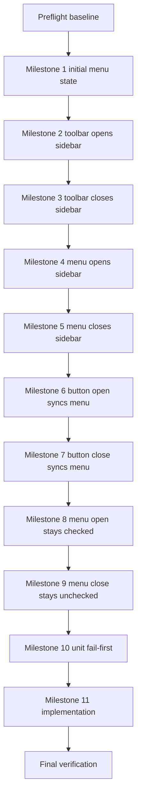

# Table Of Contents Sidebar Visibility

## Current Baseline

- `src/main.ts` creates a standard framed `BrowserWindow` and only wires file-open behavior from the application menu.
- `src/applicationMenu.ts` has a `View` menu, but it contains only stock Electron roles; there is no table-of-contents menu item or shared view-state callback.
- `src/index.html` renders only `<main id="app">` and still owns the active renderer bootstrap logic through an inline script.
- `src/renderer.ts` exists, but `src/index.html` does not load it today, so renderer-side shell state is not yet organized in testable TypeScript.
- `src/preload.ts` and `src/contracts.ts` expose only markdown-document fetch/update APIs plus the dev-only `openFile` helper used by e2e.
- Existing e2e open-file coverage already launches the app with `--test-file=./e2e/fixtures/test.md`, so sidebar-toggle coverage can reuse the same deterministic startup document.

## Prompt

You are a build orchestration agent.

Your exact goal is to add the first table-of-contents shell behavior: a sidebar that can be shown and hidden from both a Safari-like title bar toolbar button and a `View` menu item, with test coverage split into separate scenarios for each requested transition and sync check.

Explicit non-goals:
- Do not parse headings or render a real table of contents yet.
- Do not add persistence for sidebar visibility across app launches.
- Do not redesign markdown rendering, file-open behavior, or file-watching behavior.
- Do not add a second window, detached panel, or resizable split-pane drag handle in this phase.
- Do not add platform-specific title-bar polish beyond what is required to achieve the requested Safari-like toolbar treatment.

## Critical Operating Rules

- Coordinate only; do not implement milestone work yourself when executing this plan.
- Use `todowrite` for progress tracking and keep exactly one step `in_progress` at a time.
- Delegate each step to a subagent with the exact step text from the todo list.
- Wait for evidence before marking any step complete.
- Use fail-first sequencing whenever behavior changes: write tests, run them to confirm the expected failure, implement, then rerun until green.
- Keep one shared sidebar-visibility source of truth; do not let the toolbar button and menu item maintain independent state.
- Keep renderer shell work testable in TypeScript; do not grow the inline script in `src/index.html` for this feature.
- Treat environment or packaging failures separately from product failures when running e2e.
- If any fail-first test unexpectedly passes before implementation, stop immediately and report the discrepancy before continuing.

## Locked Product Decisions

- Default the table-of-contents sidebar to hidden on first render.
- Add a placeholder sidebar container with visible shell text such as `Table of Contents` and a short empty-state message; do not render heading links yet.
- Use a macOS-first window treatment by setting `titleBarStyle: "hiddenInset"` in `src/main.ts` so the custom toolbar can sit in a Safari-like title-bar area.
- Treat the dedicated sidebar-toggle e2e scenarios as macOS-only in this phase; Linux may keep the menu behavior in code, but Linux e2e coverage is out of scope for this iteration.
- Keep the toggle button inside renderer HTML in a draggable title-bar region with `-webkit-app-region: drag`, and mark the actual button as `-webkit-app-region: no-drag`.
- Add a `View` menu checkbox item labeled `Show Table of Contents` with a stable id of `view-toggle-table-of-contents`.
- Use one shared toggle action for both the toolbar button and the menu item; menu checked state, button pressed state, and sidebar visibility must always stay in sync.
- Load renderer code from `src/index.html` via `../dist/renderer.js`; treat any other path as a startup regression unless preflight evidence proves the runtime layout differs.

## Milestone Flow



## Exact Todo List

1. `Preflight / Step 1: Run baseline build and focused test commands`
2. `Preflight / Step 2: Inspect renderer entrypoint and current menu wiring`
3. `Milestone 1 / Step 1: Write initial menu unchecked e2e scenario`
4. `Milestone 1 / Step 2: Run initial menu unchecked scenario and confirm expected failure`
5. `Milestone 2 / Step 1: Write toolbar opens sidebar e2e scenario`
6. `Milestone 2 / Step 2: Run toolbar opens sidebar scenario and confirm expected failure`
7. `Milestone 3 / Step 1: Write toolbar closes sidebar e2e scenario`
8. `Milestone 3 / Step 2: Run toolbar closes sidebar scenario and confirm expected failure`
9. `Milestone 4 / Step 1: Write View menu opens sidebar e2e scenario`
10. `Milestone 4 / Step 2: Run View menu opens sidebar scenario and confirm expected failure`
11. `Milestone 5 / Step 1: Write View menu closes sidebar e2e scenario`
12. `Milestone 5 / Step 2: Run View menu closes sidebar scenario and confirm expected failure`
13. `Milestone 6 / Step 1: Write button-open updates menu checked-state e2e scenario`
14. `Milestone 6 / Step 2: Run button-open updates menu checked-state scenario and confirm expected failure`
15. `Milestone 7 / Step 1: Write button-close updates menu unchecked-state e2e scenario`
16. `Milestone 7 / Step 2: Run button-close updates menu unchecked-state scenario and confirm expected failure`
17. `Milestone 8 / Step 1: Write menu-open remains checked e2e scenario`
18. `Milestone 8 / Step 2: Run menu-open remains checked scenario and confirm expected failure`
19. `Milestone 9 / Step 1: Write menu-close remains unchecked e2e scenario`
20. `Milestone 9 / Step 2: Run menu-close remains unchecked scenario and confirm expected failure`
21. `Milestone 10 / Step 1: Write focused unit tests for shared sidebar state and menu wiring`
22. `Milestone 10 / Step 2: Run focused unit tests and confirm expected failure`
23. `Milestone 11 / Step 1: Implement shared sidebar visibility state and IPC wiring`
24. `Milestone 11 / Step 2: Implement renderer shell with title bar toolbar and toggleable sidebar`
25. `Milestone 11 / Step 3: Pass focused unit tests`
26. `Milestone 11 / Step 4: Pass all sidebar visibility e2e scenarios`
27. `Final Verification / Step 1: Run focused verification commands`

Initial todo state:
- mark `Preflight / Step 1: Run baseline build and focused test commands` as `in_progress`
- mark every other todo as `pending`

## Required Execution Pattern

For every step, in order:

1. Update `todowrite` so only the current step is `in_progress`.
2. Delegate that exact step to one subagent with only the minimum context needed for that step.
3. Wait for the subagent to stop.
4. Review the returned evidence: files changed, commands run, observed result, and failure category.
5. Mark the step `completed` only when the evidence matches the completion condition in this plan.
6. Move the next step to `in_progress`.

Milestone-specific rule for this plan:
- Milestones 1 through 9 each own exactly one user-requested e2e scenario.
- Do not merge milestones, skip milestones, or collapse multiple scenario additions into one milestone.
- When editing `e2e/features/toc-sidebar.feature`, preserve earlier milestone scenarios verbatim while appending the next exact scenario.
- When running a fail-first command for Milestones 1 through 9, target only that milestone's exact scenario name.

## Required Subagent Prompt Contract

Every delegated prompt must include these directives verbatim:

- `You are authorized for this single step only.`
- `Do not start the next step.`
- `When you finish, stop and report back with: step completed, files changed, commands run, observed result, failure category, and evidence location.`
- `Do not guess at failures; use evidence from logs, test output, and code inspection.`

Subagent context boundary rules:
- Do not send the entire plan to a subagent.
- Send only the current todo step, the files in scope, the exact commands for that step, the step-specific completion target, and the step-specific requirements or invariants needed to complete that step safely.
- Do not include future milestones, unrelated acceptance criteria, or unrelated background sections.
- If a step depends on one shared rule discovered earlier, pass only that normalized rule, not the surrounding sections that produced it.

## Exact Subagent Prompt Template

Use this exact template for every delegated step. Replace bracketed placeholders only.

```text
You are authorized for this single step only.

Current todo step: [PASTE EXACT TODO STEP TEXT]

Step goal:
[PASTE THE EXACT STEP GOAL OR COMPLETION TARGET FROM THE PLAN]

Files in scope:
[PASTE THE EXACT FILE TARGETS FOR THIS STEP, OR "none"]

Commands to run:
[PASTE THE EXACT COMMANDS FOR THIS STEP, OR "none"]

Step-specific requirements:
[PASTE ONLY THE REQUIREMENTS FOR THIS STEP FROM THE PLAN]

Do not start the next step.

When you finish, stop and report back with: step completed, files changed, commands run, observed result, failure category, and evidence location.

Use `failure category` only as one of: `none`, `product`, or `environment`.

Do not guess at failures; use evidence from logs, test output, and code inspection.
```

Required template usage rules:
- paste the todo step text exactly as written in `## Exact Todo List`
- do not include the full plan path or the full plan body in the delegated prompt
- include only the current step's requirements; do not include future milestone instructions
- if Preflight Step 2 selected a fallback single-scenario selector, replace later milestone Step 2 command blocks with that normalized command form before delegating
- for Milestones 1 through 9 Step 2, include the exact scenario name being targeted in both `Current todo step` context and `Commands to run`
- include any applicable global invariants in `Step-specific requirements`, especially fail-first expectations, product-vs-environment failure classification, and the macOS `1 executed / 0 skipped` rule for Milestones 1 through 9 Step 2

## Prompt Assembly Checklist

Use this checklist before each delegation so the template fields are filled without guesswork:

- `Current todo step`: copy from `## Exact Todo List`
- `Step goal`: copy from the step completion condition for the current step; if no completion condition exists, use the step section's explicit completion target text
- `Files in scope`: copy the step-local file targets first, then any shared file targets that the step explicitly depends on
- `Commands to run`: copy the exact fenced command block for the step, or `none` when the step is read-only
- `Step-specific requirements`: copy only the current step's requirements plus any applicable global invariants from this plan
- `Normalized selector rule`: for Milestones 1 through 9 Step 2, use the selector form proven in Preflight Step 2 and paste that exact command shape
- `Context trim check`: remove any section that the subagent does not need to complete the current step autonomously
- `No full-plan leakage check`: verify the prompt excludes the plan path, future-step content, milestone lists outside the current step, and unrelated acceptance criteria

## Step Artifact Expectations

Use these minimum artifact expectations when reviewing subagent evidence:

- read-only inspection step: file references inspected, concise findings, and `commands run: none` unless search commands were required
- test authoring step: changed test file paths plus the exact scenario names or test names added or updated
- test run step: exact command, executed/skipped counts when applicable, and the key failing or passing lines
- implementation step: changed source file paths, exact commands run, and the specific behavior now enabled

If a supposed fail-first run unexpectedly passes, stop immediately and report the discrepancy instead of continuing to the next step.

## Baseline Commands

Run these before changing tests so later failures are easier to classify:

```bash
npm ci
npm run build
npm run package
npm test -- --run src/applicationMenu.test.ts src/openFileFlow.test.ts src/viewerController.test.ts src/htmlRenderer.test.ts
npm run test:e2e -- --spec ./e2e/features/open-file.feature
```

Expected baseline interpretation:
- `npm ci` succeeds.
- `npm run build` succeeds.
- `npm run package` succeeds and produces the packaged Electron binary expected by `wdio.conf.ts` for the current platform.
- focused unit tests pass.
- the existing open-file e2e spec passes or is skipped only by platform gate.

## Preflight: Baseline And Architecture Check

### Step 1: Run baseline build and focused test commands

Run the exact Baseline Commands block above.

Completion condition:
- install, build, and focused unit tests succeed
- packaging succeeds and the packaged binary path used by `wdio.conf.ts` is recorded in the evidence
- the existing e2e command completes without unexpected harness errors
- command outputs are captured for later comparison

### Step 2: Inspect renderer entrypoint and current menu wiring

Inspect these files before writing tests:
- `src/index.html`
- `src/renderer.ts`
- `src/main.ts`
- `src/applicationMenu.ts`
- `src/applicationMenu.test.ts`
- `e2e/features/*.feature`
- `wdio.conf.ts`

Capture these architecture facts in the step evidence:
- whether `src/renderer.ts` is currently loaded by `src/index.html`
- where the current `View` menu structure is defined
- where a stable menu item id can be asserted in tests
- whether any existing renderer-shell tests can be extended versus requiring a new test file
- the exact runtime-safe script path that `src/index.html` must use to load renderer code in packaged runs
- how current Cucumber feature tags in `e2e/features/*.feature` interact with `wdio.conf.ts`
- whether the current machine architecture matches the `wdio.conf.ts` packaged-binary path branch that e2e will use
- whether `npm run test:e2e -- --spec ./e2e/features/toc-sidebar.feature --cucumberOpts.name "<scenario>"` actually executes exactly one scenario in this repo; if not, record the deterministic fallback selector before milestone work begins
- whether `src/index.html` should load `../dist/renderer.js` with `defer`; default to `defer` unless preflight evidence shows the current bootstrap contract requires otherwise

Completion condition:
- the evidence explicitly records the current renderer entrypoint strategy and the exact files that will need to change
- the evidence explicitly records the verified single-scenario selector strategy for Milestones 1 through 9
- the evidence includes one concrete proof command and the WDIO/Cucumber output lines showing exactly `1` executed and `0` skipped for the chosen selector on this machine
- any mismatch between the expected baseline and the actual repo state is called out before test authoring continues

## Milestone 1 Through Milestone 9: E2E test-first with one requested scenario per milestone

### Shared file targets for Milestones 1 through 9

- `e2e/features/toc-sidebar.feature`
- `e2e/steps/toc-sidebar.steps.ts`
- `e2e/support/hooks.ts`

### Exact feature content to build toward across Milestones 1 through 9

Use this exact Gherkin text by the end of Milestone 9:

```gherkin
@macos
Feature: Table of contents sidebar visibility

  Scenario: The initial View menu item shows that the table of contents sidebar is hidden
    Given the app is showing the initial test markdown document
    Then the table of contents sidebar is hidden
    And the View menu item for table of contents is unchecked

  Scenario: Clicking the toolbar button when the sidebar is hidden shows the sidebar
    Given the app is showing the initial test markdown document
    And the table of contents sidebar is hidden
    When the user clicks the title bar table of contents toggle button
    Then the table of contents sidebar is visible

  Scenario: Clicking the toolbar button when the sidebar is visible hides the sidebar
    Given the app is showing the initial test markdown document
    And the table of contents sidebar is visible
    When the user clicks the title bar table of contents toggle button
    Then the table of contents sidebar is hidden

  Scenario: Clicking the View menu item when the sidebar is hidden shows the sidebar
    Given the app is showing the initial test markdown document
    And the table of contents sidebar is hidden
    When the user chooses View Show Table of Contents
    Then the table of contents sidebar is visible

  Scenario: Clicking the View menu item when the sidebar is visible hides the sidebar
    Given the app is showing the initial test markdown document
    And the table of contents sidebar is visible
    When the user chooses View Show Table of Contents
    Then the table of contents sidebar is hidden

  Scenario: Clicking the toolbar button when the sidebar is hidden checks the View menu item
    Given the app is showing the initial test markdown document
    And the table of contents sidebar is hidden
    When the user clicks the title bar table of contents toggle button
    Then the View menu item for table of contents is checked

  Scenario: Clicking the toolbar button when the sidebar is visible unchecks the View menu item
    Given the app is showing the initial test markdown document
    And the table of contents sidebar is visible
    When the user clicks the title bar table of contents toggle button
    Then the View menu item for table of contents is unchecked

  Scenario: Clicking the View menu item when the sidebar is hidden leaves the View menu item checked
    Given the app is showing the initial test markdown document
    And the table of contents sidebar is hidden
    When the user chooses View Show Table of Contents
    Then the View menu item for table of contents is checked

  Scenario: Clicking the View menu item when the sidebar is visible leaves the View menu item unchecked
    Given the app is showing the initial test markdown document
    And the table of contents sidebar is visible
    When the user chooses View Show Table of Contents
    Then the View menu item for table of contents is unchecked
```

### Shared step-definition requirements for Milestones 1 through 9

- reuse the existing initial-document fixture setup from `e2e/support/hooks.ts`
- assert sidebar state through deterministic DOM markers such as `data-testid`, `aria-hidden`, `hidden`, or a stable root class
- add a deterministic step that can bring the sidebar to visible state before a scenario action without relying on prior scenario order; use one canonical setup path and document it in evidence
- trigger the menu item through Electron menu lookup using id `view-toggle-table-of-contents`
- inspect menu checked state through Electron menu APIs rather than visual heuristics
- do not automate native macOS menus with AppleScript for this feature
- preserve exact scenario names and exact step phrases above

### Shared single-scenario selection rule for Milestones 1 through 9 Step 2

- Use `--cucumberOpts.name` only if Preflight Step 2 verified it executes exactly one scenario in this repo.
- If `--cucumberOpts.name` is not reliable, switch all Milestones 1 through 9 to one deterministic fallback selector captured in preflight evidence before any milestone e2e run begins.
- Once preflight chooses the selector form, reuse that exact normalized command template for every Milestone 1 through 9 Step 2 run.
- On macOS, milestone completion requires exactly `1` scenario executed and `0` skipped.
- Treat any skipped scenario on macOS as an `environment` failure and stop.

### Milestone 1: Initial View menu item state

Scenario owned by this milestone:
- `The initial View menu item shows that the table of contents sidebar is hidden`

Step 1 completion condition:
- `e2e/features/toc-sidebar.feature` contains the feature header plus Milestone 1 scenario text exactly
- matching step definitions exist for the phrases used by this scenario

Step 2 run command:

```bash
npm run test:e2e -- --spec ./e2e/features/toc-sidebar.feature --cucumberOpts.name "The initial View menu item shows that the table of contents sidebar is hidden"
```

Expected fail-first reason:
- the app does not yet expose the sidebar shell and/or checked-state menu item to satisfy the scenario.

### Milestone 2: Toolbar button opens sidebar

Scenario owned by this milestone:
- `Clicking the toolbar button when the sidebar is hidden shows the sidebar`

Step 1 completion condition:
- Milestone 1 scenario remains unchanged
- Milestone 2 scenario text is appended exactly
- matching step definitions exist for the new phrase set

Step 2 run command:

```bash
npm run test:e2e -- --spec ./e2e/features/toc-sidebar.feature --cucumberOpts.name "Clicking the toolbar button when the sidebar is hidden shows the sidebar"
```

Expected fail-first reason:
- the app lacks the toolbar toggle button and/or hidden-to-visible sidebar transition.

### Milestone 3: Toolbar button closes sidebar

Scenario owned by this milestone:
- `Clicking the toolbar button when the sidebar is visible hides the sidebar`

Step 1 completion condition:
- earlier scenarios remain unchanged
- Milestone 3 scenario text is appended exactly
- one canonical setup step exists for the visible-before-action state

Step 2 run command:

```bash
npm run test:e2e -- --spec ./e2e/features/toc-sidebar.feature --cucumberOpts.name "Clicking the toolbar button when the sidebar is visible hides the sidebar"
```

Expected fail-first reason:
- the app lacks the visible-state setup path and/or visible-to-hidden toolbar transition.

### Milestone 4: View menu item opens sidebar

Scenario owned by this milestone:
- `Clicking the View menu item when the sidebar is hidden shows the sidebar`

Step 1 completion condition:
- earlier scenarios remain unchanged
- Milestone 4 scenario text is appended exactly
- matching step definitions exist for the new phrase set

Step 2 run command:

```bash
npm run test:e2e -- --spec ./e2e/features/toc-sidebar.feature --cucumberOpts.name "Clicking the View menu item when the sidebar is hidden shows the sidebar"
```

Expected fail-first reason:
- the app lacks the menu-backed hidden-to-visible transition.

### Milestone 5: View menu item closes sidebar

Scenario owned by this milestone:
- `Clicking the View menu item when the sidebar is visible hides the sidebar`

Step 1 completion condition:
- earlier scenarios remain unchanged
- Milestone 5 scenario text is appended exactly
- matching step definitions exist for the new phrase set

Step 2 run command:

```bash
npm run test:e2e -- --spec ./e2e/features/toc-sidebar.feature --cucumberOpts.name "Clicking the View menu item when the sidebar is visible hides the sidebar"
```

Expected fail-first reason:
- the app lacks the menu-backed visible-to-hidden transition.

### Milestone 6: Button-open syncs checked state

Scenario owned by this milestone:
- `Clicking the toolbar button when the sidebar is hidden checks the View menu item`

Step 1 completion condition:
- earlier scenarios remain unchanged
- Milestone 6 scenario text is appended exactly
- matching step definitions exist for the new phrase set

Step 2 run command:

```bash
npm run test:e2e -- --spec ./e2e/features/toc-sidebar.feature --cucumberOpts.name "Clicking the toolbar button when the sidebar is hidden checks the View menu item"
```

Expected fail-first reason:
- button-triggered state changes do not yet propagate to menu checked state.

### Milestone 7: Button-close syncs unchecked state

Scenario owned by this milestone:
- `Clicking the toolbar button when the sidebar is visible unchecks the View menu item`

Step 1 completion condition:
- earlier scenarios remain unchanged
- Milestone 7 scenario text is appended exactly
- matching step definitions exist for the new phrase set

Step 2 run command:

```bash
npm run test:e2e -- --spec ./e2e/features/toc-sidebar.feature --cucumberOpts.name "Clicking the toolbar button when the sidebar is visible unchecks the View menu item"
```

Expected fail-first reason:
- button-triggered close behavior does not yet propagate to menu unchecked state.

### Milestone 8: Menu-open remains checked

Scenario owned by this milestone:
- `Clicking the View menu item when the sidebar is hidden leaves the View menu item checked`

Step 1 completion condition:
- earlier scenarios remain unchanged
- Milestone 8 scenario text is appended exactly
- matching step definitions exist for the new phrase set

Step 2 run command:

```bash
npm run test:e2e -- --spec ./e2e/features/toc-sidebar.feature --cucumberOpts.name "Clicking the View menu item when the sidebar is hidden leaves the View menu item checked"
```

Expected fail-first reason:
- the menu item does not remain synchronized with its own open action.

### Milestone 9: Menu-close remains unchecked

Scenario owned by this milestone:
- `Clicking the View menu item when the sidebar is visible leaves the View menu item unchecked`

Step 1 completion condition:
- earlier scenarios remain unchanged
- Milestone 9 scenario text is appended exactly
- matching step definitions exist for the new phrase set

Step 2 run command:

```bash
npm run test:e2e -- --spec ./e2e/features/toc-sidebar.feature --cucumberOpts.name "Clicking the View menu item when the sidebar is visible leaves the View menu item unchecked"
```

Expected fail-first reason:
- the menu item does not remain synchronized with its own close action.

### Shared completion and failure rules for Milestones 1 through 9 Step 2

Failure classification:
- Product failure: the app launches, but the sidebar shell, toggle button, menu item, or shared state assertions are missing or incorrect.
- Environment failure: packaging fails, the Electron app does not launch, or WebdriverIO cannot connect to the app session before product behavior is exercised.

Completion condition:
- the failing command output is captured
- the failure is explicitly classified as `product` or `environment`
- the evidence states exactly `1` scenario executed and `0` skipped on macOS
- execution stops if the failure is environmental until that is resolved or reported

## Milestone 10: Unit test-first for shared state and menu wiring

### Step 1: Write focused unit tests for shared sidebar state and menu wiring

Add or update focused unit tests for the shared toggle architecture.

Required file targets:
- `src/applicationMenu.test.ts`
- `src/sidebarVisibility.test.ts`
- `src/renderer.test.ts`

Required implementation-target guidance for the tests:
- introduce `src/sidebarVisibility.ts` as the shared state owner for toggle, explicit set, current snapshot, and subscription behavior
- use `src/renderer.test.ts` to cover renderer-shell DOM behavior instead of trying to unit-test inline HTML directly
- if needed, move renderer bootstrap logic behind exported functions in `src/renderer.ts` so tests can instantiate the shell against a Happy DOM document

Required assertions:

For `src/applicationMenu.test.ts`:
- `View` contains `Show Table of Contents`
- the new item has id `view-toggle-table-of-contents`
- the new item is a checkbox item
- the new item starts unchecked
- the new item invokes the injected toggle callback when clicked

For `src/sidebarVisibility.test.ts`:
- initial visibility defaults to hidden
- `toggle()` flips hidden -> visible -> hidden
- `setVisible(true|false)` is idempotent and only emits change notifications when state actually changes
- subscribers receive the updated visible state

For `src/renderer.test.ts`:
- the shell renders the title-bar toggle button and sidebar placeholder
- the initial DOM state is hidden sidebar plus unpressed button
- clicking the button invokes the exposed toggle API once
- receiving a visibility update shows the sidebar and updates pressed state
- receiving a visibility update hides the sidebar and updates pressed state back
- clicking the button and applying the resulting visibility update uses the same DOM path as menu-triggered updates

Completion condition:
- new or updated tests encode all assertions above
- test names describe the user-visible behavior, not implementation trivia

### Step 2: Run focused unit tests and confirm expected failure

Run:

```bash
npm test -- --run src/applicationMenu.test.ts src/sidebarVisibility.test.ts src/renderer.test.ts
```

Expected failure reason:
- the new shared sidebar state module, menu wiring, and renderer shell do not exist yet or do not yet satisfy the assertions.

Failure classification:
- Product failure: the new assertions fail against the current implementation.
- Environment failure: Vitest, Happy DOM, or TypeScript setup fails before the new behavior is exercised.

Completion condition:
- the failure output is captured and classified
- the failing assertions clearly point at missing shared-state and shell behavior

## Milestone 11: Implement shared sidebar shell

### Step 1: Implement shared sidebar visibility state and IPC wiring

Implement the main-process shared state so both menu and renderer use the same toggle source.

Required file targets:
- `src/sidebarVisibility.ts`
- `src/contracts.ts`
- `src/preload.ts`
- `src/main.ts`
- `src/applicationMenu.ts`

Required behavior:
- `src/sidebarVisibility.ts` owns the canonical visible/hidden state and subscription fanout
- `src/main.ts` creates one sidebar-visibility instance for the viewer window lifecycle
- the `View` menu item delegates to the shared toggle action instead of mutating its own isolated state
- preload exposes renderer-safe methods to get initial sidebar visibility, request a toggle, and subscribe to visibility changes
- main process broadcasts sidebar visibility updates to the renderer and keeps the menu checkbox checked state synchronized
- if the renderer requests a toggle before the viewer window exists, fail safely rather than crashing the app

Implementation constraints:
- do not store visibility only in renderer memory
- do not duplicate state transitions in both `main.ts` and `applicationMenu.ts`
- keep menu ids stable for e2e

Completion condition:
- one shared state path exists from menu and renderer through the same visibility controller
- preload/contracts expose only the minimal sidebar APIs required for this feature

### Step 2: Implement renderer shell with title bar toolbar and toggleable sidebar

Implement the visible UI shell for the title bar and sidebar.

Required file targets:
- `src/index.html`
- `src/renderer.ts`
- `src/styles.css`

Expected renderer structure:
- a title-bar shell container rendered above the content area
- a toolbar button dedicated to toggling table of contents visibility
- a layout wrapper containing the sidebar region and the markdown content region
- the markdown content region continues to render into `#app`

Required behavior:
- load the built renderer entrypoint from `src/index.html` instead of keeping the new shell logic inline
- use `<script defer src="../dist/renderer.js"></script>` from `src/index.html` unless preflight evidence found a different runtime-safe path or script-loading mode; verify app boot still succeeds after this change
- show a hidden-by-default sidebar placeholder with stable text such as `Table of Contents`
- use stable selectors for automation, for example `data-testid="toc-toggle-button"` and `data-testid="toc-sidebar"`
- reflect visibility state in both accessibility and automation-friendly ways: `aria-pressed` on the button and either `hidden`, `aria-hidden`, or a stable class on the sidebar
- keep the title-bar drag region working while the toggle button remains clickable
- preserve existing markdown render flow and `baseHref` updates

Implementation constraints:
- do not remove the existing markdown body container semantics
- do not introduce the real heading-extraction feature yet
- keep the layout usable on both desktop width and narrower window widths

Completion condition:
- the app shows a Safari-like title-bar toolbar area, a toggle button, and a sidebar placeholder
- clicking the button routes through the shared toggle API instead of local-only DOM state

### Step 3: Pass focused unit tests

Run:

```bash
npm test -- --run src/applicationMenu.test.ts src/sidebarVisibility.test.ts src/renderer.test.ts
```

Completion condition:
- all focused unit tests added for this feature pass
- any unrelated pre-existing failures are called out explicitly instead of being absorbed into this feature

### Step 4: Pass all sidebar visibility e2e scenarios

Run:

```bash
npm run package
npm run test:e2e -- --spec ./e2e/features/toc-sidebar.feature
```

Completion condition:
- packaging is rerun after implementation changes and the refreshed artifact path is recorded in the evidence
- all 9 scenarios pass end to end
- evidence shows separate coverage for initial state, button-driven show/hide, menu-driven show/hide, and menu-state synchronization

## Evidence Template For Each Step

Every delegated step report should include:
- `step completed:` yes or no
- `files changed:` explicit paths or `none`
- `commands run:` exact commands or `none`
- `observed result:` one concise paragraph
- `failure category:` `none`, `product`, or `environment`
- `evidence location:` command output, test log path, or file references
- `test/scenario names:` exact unit test names or Cucumber scenario names exercised, plus executed versus skipped count when tests are involved

## Final Verification

Run these commands after all milestone steps are complete:

```bash
npm run build
npm test -- --run src/applicationMenu.test.ts src/sidebarVisibility.test.ts src/renderer.test.ts src/openFileFlow.test.ts src/viewerController.test.ts src/htmlRenderer.test.ts
npm run package
npm run test:e2e -- --spec ./e2e/features/toc-sidebar.feature
```

If macOS packaging or Electron session startup fails during e2e, classify that separately from product behavior and report it with the failing command output.
Record the packaged artifact path and timestamp evidence from the same verification run before accepting the final e2e result.

Final Verification / Step 1 completion condition:
- `npm run build` succeeds
- the focused unit test command succeeds with no unexpected failures
- `npm run package` succeeds and records the refreshed packaged artifact path and timestamp
- the full `toc-sidebar.feature` run passes with all `9` scenarios executed and `0` skipped on macOS
- the final evidence report includes the exact commands, the passing scenario count, and any non-blocking observations

## Acceptance Criteria

- The viewer window has a Safari-like title-bar toolbar treatment with a clickable table-of-contents toggle button.
- The app has a hidden-by-default table-of-contents sidebar placeholder rendered beside the markdown content area.
- Clicking the toolbar button shows and hides the sidebar.
- The `View -> Show Table of Contents` menu item shows and hides the same sidebar state.
- Menu checked state, toolbar pressed state, and sidebar visibility remain synchronized after either entry point is used.
- All 9 dedicated e2e scenarios pass, with one scenario for each requested state transition or sync assertion.
- Focused unit tests pass.
- No real table-of-contents content generation is introduced in this phase.

## Notable Assumptions Encoded In This Plan

- The first iteration should default the sidebar to hidden because the actual table-of-contents content is not implemented yet.
- A macOS-style `hiddenInset` title bar is an acceptable interpretation of the requested Safari-like toolbar.
- `src/renderer.ts` should become the real renderer entrypoint so shell behavior can be tested in TypeScript instead of expanding the inline script in `src/index.html`.
