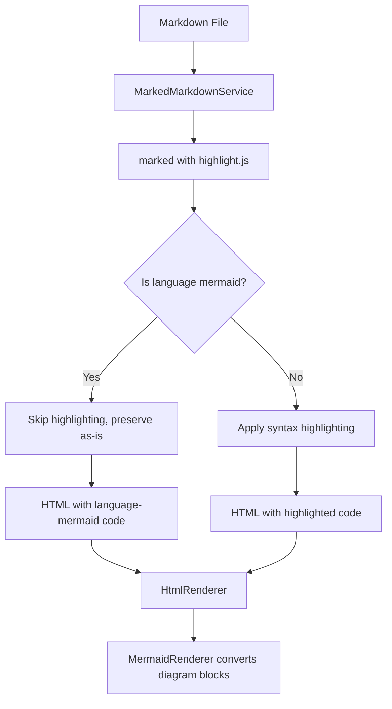

# Syntax Highlighting Implementation Plan

## Goal

Add syntax highlighting to code blocks in rendered markdown using `highlight.js`. Code blocks in markdown files should be automatically highlighted based on their language identifier (e.g., ` ```typescript `, ` ```python `).

## Non-Goals

- Add line numbers to code blocks (separate feature)
- Add copy-to-clipboard button (separate feature)
- Add line highlighting (separate feature)
- Support every language - rely on highlight.js defaults

## Current Baseline

The application currently renders code blocks with basic styling:
- Monospace font from CSS variable `var(--font-mono)`
- Background color `#f4f4f4` in `pre` elements
- No syntax highlighting - code is plain text

## User Decisions Needed

- **Theme choice**: The plan uses `github.css` which is a light theme. This matches the app's current light theme and aligns with `github-markdown-css`.

## Architecture Overview



## Exact Todo List

1. **Preflight check and install** highlight.js dependency
2. **Create syntaxHighlighter.ts module** following existing pattern
3. **Integrate highlight.js into markdownService.ts** using modern marked v15 API
4. **Add highlight.js CSS theme** to index.html
5. **Write unit tests for syntaxHighlighter.ts**
6. **Run typecheck and lint** to verify no new errors
7. **Run tests** to verify unit tests pass
8. **Verify highlighting in running app** via npm run dev

## Execution Pattern

1. Orchestrator works on exactly one step at a time
2. Update `todowrite` before starting each step
3. Delegate current step to a subagent
4. Wait for evidence (file changes, test output)
5. Mark step complete in `todowrite`

## Subagent Prompt Contract

When delegating to a subagent:
- Provide only the current step context
- Do not reference future steps
- Subagent must report: files changed, commands run, observed result

## Milestones

### Milestone 1: Preflight checks and install dependency

**Step 1: Preflight check and install**

- **Pre-flight**: Read `src/index.html` to verify the existing stylesheet link pattern
- **Action**: Add `highlight.js` as runtime dependency
- **Command**: `npm install highlight.js`
- **Expected outcome**: `highlight.js` appears in `package.json` dependencies
- **Verification**: Run `npm ls highlight.js` to confirm installation

### Milestone 2: Create syntax highlighter module

**Step 2: Create src/syntaxHighlighter.ts**

- **Action**: Create new module following the `MarkdownRenderer` interface pattern
- **File**: `src/syntaxHighlighter.ts`
- **Code contract**:
  ```typescript
  import hljs from 'highlight.js';
  
  export interface SyntaxHighlighter {
    highlight(code: string, language?: string): string;
    highlightAuto(code: string): string;
  }
  
  export function createSyntaxHighlighter(): SyntaxHighlighter {
    return {
      highlight(code: string, language?: string): string {
        if (language && hljs.getLanguage(language)) {
          return hljs.highlight(code, { language }).value;
        }
        return hljs.highlightAuto(code).value;
      },
      highlightAuto(code: string): string {
        return hljs.highlightAuto(code).value;
      }
    };
  }
  ```
- **Export**: Also export from `src/index.ts` if it exists, or update `contracts.ts`

### Milestone 3: Integrate highlight.js into markdownService.ts

**Step 3: Update src/markdownService.ts**

- **Action**: Modify the `MarkedMarkdownService` to use highlight.js during markdown parsing
- **Current state**: File wraps `marked` with basic configuration
- **Required changes**:
  1. Import `createSyntaxHighlighter` from `./syntaxHighlighter`
  2. Configure `marked` using `marked.use()` (modern v15 API, not deprecated `setOptions`)
  3. Skip highlighting for `mermaid` language blocks to avoid conflicts with MermaidRenderer
  4. Apply to `code` blocks only (not inline code)
  
- **Pre-requisite**: Read `src/index.html` to verify the stylesheet link pattern (for consistent CDN approach in step 5)
- **Import path**: Verify that `./syntaxHighlighter` resolves correctly from `src/markdownService.ts` location (should work since both files are in `src/`)
- **Configuration placement**: The `marked.use()` call should be placed at module load time (e.g., at the top of markdownService.ts or in main.ts before the service is instantiated). This modifies the global `marked` instance and will apply to all subsequent render calls.

**Recommended implementation** in `markdownService.ts`:
```typescript
import { marked } from 'marked';
import hljs from 'highlight.js';
import { createSyntaxHighlighter, SyntaxHighlighter } from './syntaxHighlighter';

// Create syntax highlighter instance
const syntaxHighlighter = createSyntaxHighlighter();

// Configure marked with highlight.js using the modern marked v15 API
marked.use({
  gfm: true,
  breaks: false,
  renderer: {
    code(code: string, language?: string): string {
      // Skip highlighting for mermaid blocks - MermaidRenderer handles these
      if (language === 'mermaid') {
        return `<pre><code class="language-mermaid">${code}</code></pre>`;
      }
      
      // Highlight with language if known, otherwise auto-detect
      const highlighted = syntaxHighlighter.highlight(code, language);
      
      // Use standard language-xxx class (highlight.js expects this format)
      const langClass = language ? `language-${language}` : '';
      return `<pre><code class="${langClass}">${highlighted}</code></pre>`;
    }
  }
});
```

**Important**: The mermaid block check is critical. The `MermaidRenderer` processes `language-mermaid` blocks after HTML rendering. If these blocks are highlighted by highlight.js first, mermaid will fail to render.

- **Verification**: Render a markdown file with code blocks and inspect the HTML for `hljs` classes

### Milestone 4: Add highlight.js CSS theme

**Step 5: Add CSS theme**

- **Action**: Add highlight.js CSS to `index.html` using existing CDN pattern
- **File to modify**: `index.html`
- **Theme selection**: `github.css` (matches existing `github-markdown-css` theme)
- **Add in index.html head** (after existing stylesheet link):
```html
<link rel="stylesheet" href="https://cdnjs.cloudflare.com/ajax/libs/highlight.js/11.9.0/styles/github.min.css">
```

- **Why CDN**: This matches the existing pattern for `github-markdown-css` in index.html and avoids build complexity with CSS imports in Electron renderer
- **Verification**: Render a markdown file with code blocks - they should have colored syntax

### Milestone 5: Write unit tests and verify

**Step 6: Create src/syntaxHighlighter.test.ts**

- **Action**: Write unit tests for the syntax highlighter module
- **Test cases**:
  1. `highlight` with valid language returns HTML with span.hljs-* classes
  2. `highlight` with invalid language falls back to auto-detection
  3. `highlight` with no language falls back to auto-detection
  4. `highlightAuto` detects language and returns highlighted HTML
  5. Mermaid blocks are preserved (syntaxHighlighter passes through)

- **Example test**:
```typescript
import { describe, it, expect } from 'vitest';
import { createSyntaxHighlighter } from './syntaxHighlighter';

describe('SyntaxHighlighter', () => {
  const highlighter = createSyntaxHighlighter();

  it('highlights typescript code', () => {
    const code = 'const x: number = 1;';
    const result = highlighter.highlight(code, 'typescript');
    expect(result).toContain('hljs-keyword');
    expect(result).toContain('hljs-title');
  });

  it('falls back to auto-detection for unknown language', () => {
    const code = 'const x = 1;';
    const result = highlighter.highlight(code, 'notalanguage');
    expect(result).toContain('hljs');
  });
});
```

**Also add integration test in src/markdownService.test.ts** (if it exists, or create it):
```typescript
import { describe, it, expect } from 'vitest';
import { createMarkedMarkdownService } from './markdownService';

describe('MarkedMarkdownService with syntax highlighting', () => {
  const markdownService = createMarkedMarkdownService();

  it('skips highlighting for mermaid blocks', () => {
    const markdown = '```mermaid\ngraph TD;\nA-->B;\n```';
    const result = markdownService.render(markdown);
    expect(result).not.toContain('hljs-');
    expect(result).toContain('language-mermaid');
  });

  it('highlights typescript code blocks', () => {
    const markdown = '```typescript\nconst x = 1;\n```';
    const result = markdownService.render(markdown);
    expect(result).toContain('hljs-keyword');
    expect(result).toContain('language-typescript');
  });
});
```

- **Command**: `npm run test -- syntaxHighlighter.test.ts`
- **Expected**: All tests pass

**Step 7: Run typecheck and lint**

- **Command**: `npm run typecheck`
- **Command**: `npm run lint`
- **Expected**: No new errors or warnings

### Milestone 6: End-to-end verification

**Step 8: Verify highlighting in running app**

- **Action**: Run the app with a markdown file containing code blocks
- **Test file**: Create or use existing markdown with various languages
- **Verification**:
  1. Run `npm run dev`
  2. Open a markdown file with code blocks (e.g., TypeScript, Python, JSON)
  3. Inspect rendered code blocks in DevTools
  4. Confirm code blocks have syntax colors applied

**Sample test markdown** (for manual verification):
```markdown
# Test Code Blocks

## TypeScript
```typescript
interface User {
  name: string;
  age: number;
}
const user: User = { name: "Alice", age: 30 };
```

## Python
```python
def hello():
    print("Hello, world!")
```

## JSON
```json
{"key": "value"}
```
```

## Acceptance Criteria

1. **Dependency installed**: `highlight.js` appears in `package.json` dependencies
2. **Module created**: `src/syntaxHighlighter.ts` exists with proper interface
3. **Integration complete**: Code blocks in rendered HTML have language classes
4. **CSS applied**: Code blocks display with syntax colors (not just monochrome)
5. **Mermaid blocks preserved**: Mermaid code blocks skip highlighting and are passed through
6. **TypeScript passes**: `npm run typecheck` succeeds with no new errors
7. **Lint passes**: `npm run lint` succeeds with no new warnings
8. **Unit tests pass**: `npm run test` succeeds for syntaxHighlighter tests

## Failure Modes

| Failure | Investigation |
|---------|---------------|
| highlight.js not found at runtime | Check package.json and node_modules |
| Code blocks not highlighted | Verify marked renderer is configured correctly |
| No colors displayed | Check that highlight.js CSS is imported in renderer |
| Tests fail | Check syntaxHighlighter implementation matches interface |
| TypeScript errors | Ensure proper imports and type annotations |

## Environment Notes

- **Platform**: macOS (darwin)
- **Electron**: v41
- **Node**: Current version from electron-vite
- **CSS import**: Must use electron-vite compatible import for highlight.js styles

## Supporting Files

Existing files that may need modification:
- `src/markdownService.ts` - Integrate highlight.js
- `src/rendererBootstrap.ts` - Import highlight.js CSS
- `src/contracts.ts` - May need new interface (optional, minimal)
- `package.json` - Add dependency
- `index.html` - Alternative CSS import location