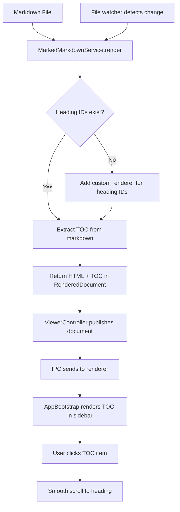

# Table of Contents Sidebar Feature

## Prompt

Implement a functional table of contents sidebar that extracts headings from the rendered markdown and displays them as clickable navigation links.

## Current Baseline State

The sidebar foundation is already in place:
- **Sidebar HTML** (`index.html`): `<aside class="toc-sidebar">` with title "Table of Contents" and placeholder "No table of contents available."
- **Toggle Button** (`index.html`): `<button class="toc-toggle-button">` in the title bar
- **Sidebar Visibility** (`sidebarVisibility.ts`): `SidebarVisibility` class manages toggle state with pub/sub
- **Sidebar Integration** (`sidebarIntegration.ts`): IPC communication between main and renderer for visibility changes
- **Renderer Bootstrap** (`rendererBootstrap.ts`): `AppBootstrap` class handles sidebar toggle and visibility updates
- **CSS** (`styles.css`): Sidebar layout, width (240px), and basic styling exist

## Non-negotiable Rules

1. **Performance**: Extract TOC from markdown in the main process to avoid DOM queries in the renderer
2. **Live Updates**: TOC must update automatically when the markdown file changes via file watcher
3. **Smooth Scrolling**: Clicking a TOC item scrolls smoothly to the heading
4. **No Test Changes**: Do not write or modify any tests
   - **Note**: The interface change from `string` to `{ html, toc }` will cause test failures in `markdownService.test.ts` and `viewerController.test.ts`. These failures are expected. Do not modify tests — report them as expected outcomes.

## Exact Todo List

- [ ] **Preflight verification**: Run typecheck and tests to establish baseline
- [ ] **Check heading ID generation**: Verify if `marked` generates `id` attributes on headings, or add custom renderer
- [ ] **Define TOC interface**: Add `TableOfContentsItem` type to `contracts.ts`
- [ ] **Extend RenderedDocument**: Add `toc` property to `RenderedDocument` interface
- [ ] **Update MarkdownRenderer interface**: Modify to return `{ html: string; toc?: TableOfContentsItem[] }`
- [ ] **Create slugify utility**: Add function to generate heading IDs from text
- [ ] **Create TOC extraction logic**: Implement heading extraction using marked lexer
- [ ] **Update MarkedMarkdownService**: Return TOC alongside HTML when rendering
- [ ] **Add custom marked renderer**: Configure marked to add `id` attributes to headings using same slugify logic
- [ ] **Update ViewerController**: Pass TOC through to the renderer
- [ ] **Update AppBootstrap**: Render TOC in sidebar when document changes
- [ ] **Implement smooth scrolling**: Add click handler to TOC items with smooth scroll
- [ ] **Add TOC styling**: Add CSS for nested heading levels and links

## Execution Pattern

The orchestrator must work on exactly one step at a time:
1. Update `todowrite` with the current step marked as `in_progress`
2. Delegate the step to a subagent with a precise prompt
3. Wait for evidence (files changed, commands run, observed result)
4. Mark the step as `completed` before proceeding

## Subagent Prompt Contract

When delegating to a subagent:
- Provide only the current step details
- Do NOT include future steps in the prompt
- Stop after completion of the assigned step
- Report: files changed, commands run, observed result

## Mermaid Flow



## Detailed Milestone Steps

### Milestone 0: Preflight Verification

**Step 0**: Establish baseline state

**Commands to run:**
```bash
npm run typecheck
npm run test -- --run
```

**Expected**: All tests pass, no TypeScript errors. This establishes a clean baseline before implementation.

**Completion evidence**: Baseline state confirmed.

---

### Milestone 1: Verify Heading ID Generation

**Step 1**: Check if `marked` generates `id` attributes on headings

**Commands to test:**
```bash
# Check marked documentation or test locally
node -e "
const { marked } = require('marked');
marked.setOptions({ gfm: true });
const result = marked.parse('# Hello World\n\n## Sub Section');
console.log(result);
"
```

**Expected output**: If `<h1 id="hello-world">` appears in output, IDs are generated. If not, need custom renderer.

**Strategy**: Regardless of whether marked adds IDs, the implementation in Milestone 3 will configure a custom renderer that applies the same slugify logic to both:
1. The TOC links (generated from lexer tokens)
2. The rendered HTML headings (via custom renderer)

This ensures the TOC `href="#heading-id"` matches the heading's `id` attribute in the HTML.

**Completion evidence**: Either confirmed IDs exist, or identified need for custom renderer.

---

### Milestone 2: Define TOC Types and Extend RenderedDocument

**Step 2**: Add `TableOfContentsItem` interface to `contracts.ts`

**File to modify**: `src/contracts.ts`

**Add after existing interfaces:**
```typescript
export interface TableOfContentsItem {
  id: string;
  text: string;
  level: number; // 1-6 for h1-h6
}
```

**Step 3**: Extend `RenderedDocument` to include TOC

**File to modify**: `src/contracts.ts`

**Change RenderedDocument to:**
```typescript
export interface RenderedDocument {
  html: string;
  baseHref: string;
  toc?: TableOfContentsItem[];
}
```

**Completion evidence**: TypeScript compiles without errors, new types are exported.

---

### Milestone 2b: Update MarkdownRenderer Interface

**Step 4**: Update the `MarkdownRenderer` interface to return TOC data

**File to modify**: `src/contracts.ts`

**Change the interface:**
```typescript
export interface MarkdownRenderer {
  render(markdown: string): { html: string; toc?: TableOfContentsItem[] };
}
```

**Note**: This is a breaking change to the interface, so `MarkedMarkdownService.render()` will need to return `{ html, toc }` instead of just a string.

**Completion evidence**: Interface updated, TypeScript compiles.

---

### Milestone 3: Implement TOC Extraction in Main Process

**Step 5**: Create slugify utility function

**File to modify**: `src/markdownService.ts`

**Add at the top of the file:**
```typescript
function slugify(text: string): string {
  return text
    .toLowerCase()
    .replace(/[^\w\s-]/g, "")
    .replace(/\s+/g, "-")
    .replace(/-+/g, "-")
    .trim();
}
```

**Step 6**: Update `MarkedMarkdownService` to extract TOC and configure custom renderer

**File to modify**: `src/markdownService.ts`

**Changes:**
1. Configure `marked` with a custom renderer that adds `id` attributes to headings using the slugify function
2. Use `marked.lexer()` to extract heading tokens before rendering
3. Return `{ html, toc }` object instead of just HTML string

**Example implementation:**
```typescript
export class MarkedMarkdownService implements MarkdownRenderer {
  constructor(private readonly marked: MarkedInstance) {
    // Configure custom renderer to add IDs to headings
    const renderer = new this.marked.Renderer();
    renderer.heading = ({ text, depth }: { text: string; depth: number }) => {
      const id = slugify(text);
      return `<h${depth} id="${id}">${text}</h${depth}>`;
    };
    this.marked.setOptions({ renderer, gfm: true });
  }

  render(markdown: string): { html: string; toc?: TableOfContentsItem[] } {
    // Extract headings using lexer
    const tokens = this.marked.lexer(markdown);
    const toc: TableOfContentsItem[] = [];
    
    for (const token of tokens) {
      if (token.type === "heading") {
        const text = token.text || "";
        toc.push({
          id: slugify(text),
          text: text,
          level: token.depth,
        });
      }
    }
    
    const html = this.marked.parse(markdown) as string;
    return { html, toc: toc.length > 0 ? toc : undefined };
  }
}
```

**Completion evidence**: `MarkedMarkdownService.render()` returns `{ html, toc }` and headings in rendered HTML have `id` attributes.

---

### Milestone 4: Pass TOC Through ViewerController

**Step 7**: Update `ViewerController` to include TOC in published document

**File to modify**: `src/viewerController.ts`

**Change the `refresh()` method to:**
```typescript
private async refresh(): Promise<void> {
  const markdown = await this.fileReader.read(this.filePath);
  const { html, toc } = this.markdownRenderer.render(markdown);
  this.latestDocument = {
    html,
    baseHref: pathToFileURL(`${path.dirname(this.filePath)}${path.sep}`).href,
    toc,
  };
  this.publishDocument(this.latestDocument);
}
```

**Completion evidence**: ViewerController publishes documents with TOC data.

**Note**: Since `IPC_HTML_UPDATED` sends the full `RenderedDocument` with TOC, the existing IPC automatically carries TOC data to the renderer. No additional IPC channels needed.

---

### Milestone 5: Render TOC in Sidebar

**Step 8**: Update `AppBootstrap` to render TOC in sidebar

**File to modify**: `src/rendererBootstrap.ts`

**Changes:**
1. Add a method `renderToc(items: TableOfContentsItem[])` that generates HTML for the TOC
2. In `renderDocument()`, after HTML renders, check if document has TOC and render it
3. Replace the "No table of contents available." message when TOC exists

**TOC HTML structure:**
```html
<nav class="toc-nav">
  <ul class="toc-list">
    <li class="toc-item toc-level-1">
      <a href="#heading-id">Heading text</a>
    </li>
    <!-- nested levels use additional classes -->
  </ul>
</nav>
```

**Completion evidence**: Sidebar displays clickable heading links when markdown has headings.

---

### Milestone 6: Implement Smooth Scrolling

**Step 9**: Add click handler for TOC links with smooth scroll

**File to modify**: `src/rendererBootstrap.ts`

**Add in `renderToc()` or after rendering:**
```typescript
tocSidebar.querySelectorAll(".toc-list a").forEach((link) => {
  link.addEventListener("click", (event) => {
    event.preventDefault();
    const href = (link as HTMLAnchorElement).getAttribute("href");
    if (!href) return;
    const targetId = href.substring(1); // remove #
    const target = document.getElementById(targetId);
    if (target) {
      target.scrollIntoView({ behavior: "smooth", block: "start" });
    }
  });
});
```

**Completion evidence**: Clicking TOC item smoothly scrolls to heading.

---

### Milestone 7: Add TOC Styling

**Step 10**: Add CSS for TOC items

**File to modify**: `src/styles.css`

**Add after existing sidebar styles:**
```css
/* TOC Navigation */
.toc-nav {
  font-size: 13px;
}

.toc-list {
  list-style: none;
  padding: 0;
  margin: 0;
}

.toc-item {
  margin: var(--spacing-xs) 0;
}

.toc-item a {
  color: var(--color-text-muted);
  text-decoration: none;
  display: block;
  padding: var(--spacing-xs) var(--spacing-sm);
  border-radius: var(--border-radius);
  transition: all var(--transition-fast);
}

.toc-item a:hover {
  color: var(--color-text);
  background-color: var(--color-bg-hover);
}

/* Nested heading levels */
.toc-level-2 {
  padding-left: var(--spacing-lg);
}

.toc-level-3 {
  padding-left: var(--spacing-xl);
}

.toc-level-4 {
  padding-left: var(--spacing-xxl);
}

.toc-level-5,
.toc-level-6 {
  padding-left: calc(var(--spacing-xxl) + var(--spacing-lg));
}
```

**Completion evidence**: TOC displays with proper indentation and hover states.

---

## Verification

After implementation, verify:

1. **Toggle works**: Click sidebar button → sidebar appears/disappears
2. **TOC displays**: Open markdown file → headings appear in sidebar
3. **Clicking works**: Click heading in sidebar → smooth scroll to heading in document
4. **Live updates**: Edit markdown file → TOC updates automatically
5. **Empty state**: Open file with no headings → "No table of contents available." message shows
6. **All levels**: Verify h1 through h6 all appear with proper nesting

## Acceptance Criteria

- [ ] Sidebar toggle button shows/hides the sidebar
- [ ] TOC displays all heading levels (h1-h6) from the markdown file
- [ ] Clicking a TOC item smoothly scrolls to the corresponding heading
- [ ] TOC updates automatically when the markdown file is modified
- [ ] Empty markdown files show "No table of contents available."
- [ ] Nested headings are visually indented in the TOC
- [ ] No TypeScript errors
- [ ] No lint errors
- [ ] Application builds successfully